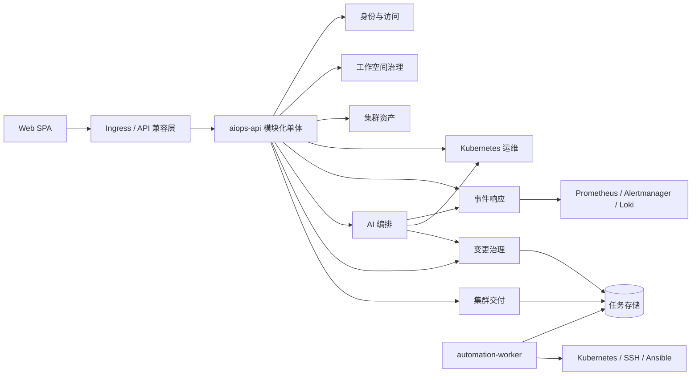

# K8s-Platform DDD 架构重构方案 v2

> 文档版本：v2.0-draft  
> 编制日期：2026-07-28  
> 文档状态：待架构评审  
> 文档定位：替代 `architecture-refactor-plan.md` v1.8 中的实施设计；原文档保留为历史评审记录

## 1. 架构决策摘要

当前系统不应从一个 Go 进程直接拆成 11 个微服务。近期目标确定为：

1. 将后端重构为具有强边界的模块化单体。
2. 优先把长任务执行抽取为可独立部署的 `automation-worker`。
3. 模块化阶段保留一个 MySQL 实例和一个物理数据库，先落实表与 Repository 所有权。
4. 通过兼容层引入 API v2，不要求前端一次性迁移。
5. AI、事件接入、流式网关只有在 SLO、扩缩容、团队归属或故障隔离证据充分时才物理拆分。

目标不是固定的服务数量，而是一组能独立演进的限界上下文。这些上下文既可以部署在同一个进程，也可以在不重写业务规则的前提下抽取为服务。



## 2. 基于代码事实的诊断

### 2.1 结构性问题

| 问题 | 当前证据 | 直接后果 |
|---|---|---|
| 分层单体但没有领域所有权 | 71 个生产 Service 文件集中在 `internal/service`，Controller 和 Service 直接使用持久化 Model | 包边界无法阻止跨领域修改 |
| 跨上下文直接访问数据库 | Incident 读取 `model.Cluster`；AI 工具直接查询 Project；部署服务直接调用集群注册 | 物理拆分后会变成高频、脆弱的分布式调用 |
| 领域模型与持久化模型混用 | GORM struct 同时承担数据库映射、业务数据和响应数据来源 | 表结构变化向业务规则和 API 泄漏 |
| 命令被建模为 Controller 动作 | 大量 `transition`、`toggle`、`execute`、`retry` 和集合级 `/edit` 路由 | 前置条件、幂等、版本控制、审计语义不一致 |
| 运行状态保存在本机 | 终端票据、日志票据保存在内存；任务取消函数属于单进程 | 多副本路由和重启恢复不可靠 |
| HTTP 失败语义被隐藏 | 多数业务错误使用 HTTP 200 加应用错误码 | 网关、客户端、重试、Metrics 和告警无法正确判断失败 |
| 产品规划与架构重构混在一起 | CI/CD、制品库、CMDB 只有前端模拟页面，没有后端领域实现 | 尚不存在的能力被错误定义成待拆微服务 |

### 2.2 DDD 诊断

当前系统有目录分层和 Service 类，但还没有可约束的限界上下文：

- `internal/service` 本质上是事务脚本集合，不是领域模型。
- 一致性边界主要由数据库表决定，而不是聚合根决定。
- 跨领域协作依赖直接 Go 调用和跨领域查表。
- 已存在状态机，但不变式被实现成字符串更新。
- 文档描述了领域事件，但状态变化与事件发布没有事务一致性。
- `terminal-svc` 是按 WebSocket 技术协议拆分，WebSocket 不是业务子域。

因此本次重构的顺序必须是：领域自治优先，进程自治其次。

## 3. 领域战略设计

### 3.1 核心域、支撑域、通用域

| 类型 | 子域 | 战略定位 |
|---|---|---|
| 核心域 | Kubernetes 运维 | 沉淀安全的集群检查、变更与治理能力 |
| 核心域 | 事件响应 | 负责运维事件生命周期、证据和处置时间线 |
| 核心域 | AI 编排 | 负责上下文构造、诊断、模型路由和可解释建议 |
| 核心域 | 变更治理 | 将建议转化为经过审批、可审计、幂等、可验证的执行 |
| 支撑域 | 集群资产 | 管理集群身份、连接凭据引用、能力和健康快照 |
| 支撑域 | 集群交付 | 管理服务器、凭据、部署计划、预检和安装工作流 |
| 支撑域 | 工作空间治理 | 管理项目与集群、命名空间、访问范围的绑定 |
| 通用域 | 身份与访问 | 登录、用户、角色、权限、会话、密码重置 |
| 通用域 | 审计账本 | 追加写审计和合规查询 |

CI/CD、制品管理和企业 CMDB 不进入本轮重构基线。它们需要单独进行产品调研和 ADR 决策。应优先集成 Harbor、GitLab、Argo CD、Prometheus、Alertmanager、Loki 等成熟系统，再决定是否建设平台自有产品。

### 3.2 AIOps 核心闭环

平台的核心业务流定义为：

```text
信号 -> 事件 -> 证据 -> 诊断 -> 变更提案
     -> 策略与审批 -> 执行 -> 验证 -> 知识沉淀
```

强制所有权规则：

- 事件响应上下文拥有事件状态、证据引用、诊断引用和处置时间线。
- AI 编排可以创建诊断和变更草案，但无权直接执行基础设施命令。
- 变更治理拥有风险分级、审批策略、提案版本、审批记录、执行授权和验证条件。
- Kubernetes 运维与集群交付只暴露明确的命令端口，不接受未经治理的模型 Tool Call。
- 审计账本独立记录每次敏感决策和命令，不能依赖 AI 对话历史代替审计。

这样可以避免提示词、模型供应商故障或工具调用缺陷绕过生产变更控制。

## 4. 限界上下文设计

### 4.1 上下文目录

| 限界上下文 | 数据所有权 | 聚合根 | 明确不负责 |
|---|---|---|---|
| 身份与访问 `iam` | 用户、角色、权限、认证会话 | `User`、`Role`、`AuthSession` | 项目、集群、审计存储 |
| 工作空间治理 `workspace` | 项目、集群与命名空间访问范围 | `Workspace`、`ProjectScope` | kubeconfig、K8s 资源 |
| 集群资产 `fleet` | 集群身份、加密连接引用、能力、监控源 | `Cluster` | 实时 K8s 对象、部署计划 |
| Kubernetes 运维 `kops` | 资源查询与变更、Manifest、Helm、终端票据、权限审计 | `Operation`、`ManifestApplication`、`PermissionAudit` | 集群安装、AI 提案 |
| 事件响应 `incident` | 告警规则、事件、证据与时间线 | `AlertRule`、`Incident` | 原始时序指标、模型供应商 |
| AI 编排 `ai` | 模型、供应商、对话、消息、诊断、工具观测 | `Conversation`、`DiagnosisRun` | 审批权和执行权 |
| 变更治理 `change` | 提案、策略、审批、执行、验证 | `ChangeProposal`、`Execution` | Prompt、目标域数据库 |
| 集群交付 `provisioning` | 服务器、SSH 凭据、仓库、部署计划、预检、任务 | `Server`、`Credential`、`ProvisioningPlan` | 交付完成后的集群生命周期 |
| 审计账本 `audit` | 不可变的主体、动作、目标、结果记录 | `AuditEntry` | 用户认证和业务状态 |

### 4.2 关键聚合不变式

#### Cluster 聚合

- 集群名称在 Workspace 内唯一，不要求全局唯一。
- 连接凭据只保存 Secret ID 和版本，不允许查询 API 返回明文。
- 健康状态是观测值，不得隐式修改集群身份数据。
- 集群存在活动交付或变更执行时拒绝删除。
- kubeconfig 轮换必须递增聚合版本并发布 `ClusterConnectionRotated`。

#### Incident 聚合

- 状态机为 `open -> acknowledged -> diagnosing -> awaiting_approval -> executing -> verifying -> resolved`。
- 状态命令必须校验当前状态和期望聚合版本。
- 一个事件可关联多次诊断和多次执行尝试。
- 解决事件必须有成功验证结果，或明确的人工解决原因。
- Alertmanager 重复消息按来源和 fingerprint 幂等去重。

#### ChangeProposal 聚合

- 提交后的目标、Patch、风险、证据和验证条件不可修改。
- 修改提案必须创建新 Revision，旧审批立即失效。
- 高风险提案禁止提案人单人审批。
- 执行时必须携带被批准的精确 Revision 和幂等键。
- 执行结果不可覆盖；重试是在同一 Execution 下新增 Attempt。

#### ProvisioningPlan 聚合

- 只有预检通过的 Draft 才能进入调度。
- 一个计划 Revision 同时只能有一个活动执行。
- 重试只能从显式声明为可重启的步骤开始。
- Worker 通过可续租的数据库 Lease 获得任务所有权。
- 安装成功发布 `ClusterProvisioningCompleted`，由应用层流程管理器完成集群注册。

### 4.3 上下文映射

| 上游 -> 下游 | DDD 关系 | 稳定契约 |
|---|---|---|
| IAM -> 全部上下文 | 发布语言 PL | 签名后的 Actor Claims 与权限词汇表 |
| Workspace -> Fleet/Kops/Incident | 客户-供应商 | `ProjectScopeView`、范围校验 Port |
| Fleet -> Kops/Incident/AI | 开放主机服务 OHS | 稳定的集群引用与能力 API |
| Kops -> Kubernetes | 防腐层 ACL | 应用命令到 client-go 对象的显式翻译 |
| Incident -> AI | 客户-供应商 | 携带证据引用的诊断请求 |
| AI -> Change | 仅提交草案的遵奉者 | 提案草案 Schema；Change 必须重新校验全部规则 |
| Change -> Kops/Provisioning | 开放主机服务 OHS | 已授权的命令信封 |
| Provisioning -> Fleet | 领域事件 + 流程管理器 | 安装成功后的安全注册交接 |
| 全部上下文 -> Audit | 集成事件 | 追加写审计信封 |

禁止任何上下文 import 其他上下文的 Repository、GORM Entity、Controller 或内部 Service 实现。

## 5. 代码架构

### 5.1 依赖方向

每个上下文内部使用端口与适配器：

```text
HTTP/gRPC Adapter -> Application Command/Query Handler -> Domain Model
                                      |                    |
                                      v                    v
                                Outbound Ports <- Persistence/External Adapters
```

Domain 只能依赖标准库和极小的 Shared Kernel，禁止依赖 Gin、GORM、Redis、Kubernetes Client、HTTP Client 和其他上下文。

推荐目录：

```text
backend/
  cmd/
    api/
    automation-worker/
  internal/
    iam/
    workspace/
    fleet/
    kops/
    incident/
    ai/
    change/
    provisioning/
    audit/
  internal/<context>/
    domain/          # 聚合、值对象、领域服务、领域事件
    application/     # Command、Query、Handler、事务边界
    ports/           # Repository 与上下游契约
    adapters/
      http/
      mysql/
      redis/
      kubernetes/
  internal/platform/ # 配置、HTTP Server、Telemetry、事务与 Outbox Runtime
  pkg/api/           # 生成的公共 API 类型，不放领域逻辑
```

### 5.2 Command 与 Query 分离

这里的 CQRS 指应用模型分离，不代表立即使用两个数据库：

- Command Handler 加载一个聚合、执行不变式、持久化聚合，并在同一事务写入 Outbox。
- Query Handler 使用专门的 Projection，可以读取本上下文拥有的查询表。
- Dashboard 和 AI 证据查询使用 Read API 或 Projection，不得读取其他上下文的 Repository。
- 长任务命令返回 `Operation` 资源并异步执行。

### 5.3 Shared Kernel 边界

允许共享：

- `ActorID`、`WorkspaceID`、`ClusterID`、`RequestID`、`IdempotencyKey`；
- Clock、ID Generator、分页基础类型；
- 领域事件信封和通用错误类别。

禁止共享：

- GORM Base Model；
- Cluster、User、Project、Incident、Proposal 等业务 Struct；
- Generic Repository；
- Kubernetes Service Client；
- 业务校验 Helper。

## 6. 数据架构

### 6.1 近期数据库决策

模块化阶段保留一个 MySQL 实例和一个物理数据库，通过表归属和 Repository 包实现逻辑隔离。

| 上下文 | 初始表所有权 |
|---|---|
| IAM | users、roles、permissions、用户角色关系、认证尝试与重置 |
| Workspace | projects、项目命名空间与访问范围 |
| Fleet | clusters、集群能力、连接版本 |
| Kops | Manifest 记录、权限审计、Operation 记录 |
| Incident | 告警规则、事件、时间线、证据引用 |
| AI | Provider、Model、Conversation、Message、Diagnosis、Usage |
| Change | Proposal、Approval、Execution、Verification |
| Provisioning | Server、Credential、Plan、Step、Job、Log、Repository |
| Audit | 追加写 Audit Entry |

约束：

1. 只有拥有者上下文可以写对应表。
2. Command Handler 禁止跨上下文 JOIN。
3. 只有消费者已迁移为 ID 引用和契约调用后，才移除跨上下文数据库外键。
4. 物理分库必须和进程抽取同时发生，不允许为“DDD 形式”提前分库。
5. 敏感数据通过 `SecretStore` Port 保存，业务表只存 Secret Reference 和 Key Version。

### 6.2 可靠领域事件

状态变化和事件发布使用 Transactional Outbox。同进程阶段由进程内 Dispatcher 消费 Outbox；只有出现跨进程消费者时才引入 NATS JetStream。

```json
{
  "event_id": "uuid",
  "event_type": "incident.diagnosis_requested.v1",
  "aggregate_id": "inc_123",
  "aggregate_version": 7,
  "workspace_id": "ws_1",
  "occurred_at": "2026-07-28T10:00:00Z",
  "actor": { "type": "user", "id": "42" },
  "correlation_id": "req_123",
  "causation_id": "cmd_123",
  "data": {}
}
```

消费者必须按 `event_id` 幂等。Event 表达已经发生的事实，使用过去式；Command 不能伪装成广播事件。

## 7. API v2 设计

### 7.1 契约规范

1. 基础路径统一为 `/api/v2`，OpenAPI 是唯一契约源。
2. 创建成功返回 `201`，异步命令返回 `202`，删除成功返回 `204`。
3. 错误使用 `application/problem+json` 和正确 HTTP Status，废弃“HTTP 200 + 业务错误码”。
4. 所有请求携带 `X-Request-ID`；异步变更命令必须携带 `Idempotency-Key`。
5. 聚合更新使用 `If-Match` 或 `expected_version`，避免丢失更新。
6. 集合过滤使用 Query Parameter，资源标识放在 Path。
7. 领域命令建模成明确资源，禁止通用 `/transition`、`/toggle`、集合级 `/edit`。
8. API DTO 禁止暴露 GORM Entity、加密字段、Provider Secret 和原始 kubeconfig。
9. 权限使用 `incident:approve`、`cluster:operate` 等领域能力，并独立校验 Workspace/Cluster Scope。
10. 废弃接口返回 `Deprecation` 和 `Sunset` Header，至少兼容两个版本。

错误示例：

```json
{
  "type": "https://aiops.example/problems/incident-transition-conflict",
  "title": "Incident state conflict",
  "status": 409,
  "detail": "The incident is already executing",
  "instance": "/api/v2/incidents/inc_123/diagnosis-runs",
  "code": "INCIDENT_STATE_CONFLICT",
  "request_id": "req_123"
}
```

### 7.2 核心资源 API

#### 集群资产

```text
GET    /api/v2/clusters
POST   /api/v2/clusters
GET    /api/v2/clusters/{cluster_id}
PATCH  /api/v2/clusters/{cluster_id}
DELETE /api/v2/clusters/{cluster_id}
POST   /api/v2/clusters/{cluster_id}/connection-checks
POST   /api/v2/clusters/{cluster_id}/connection-rotations
GET    /api/v2/clusters/{cluster_id}/capabilities
```

`connection-checks` 是 Operation 资源，不再使用看似查询、实际执行远程调用的 `check-health` 动作。

#### Kubernetes 运维

常用工作流提供领域 API，高级资源提供受控的 Generic Resource API：

```text
GET  /api/v2/clusters/{cluster_id}/namespaces/{namespace}/workloads
GET  /api/v2/clusters/{cluster_id}/namespaces/{namespace}/workloads/{kind}/{name}
POST /api/v2/clusters/{cluster_id}/namespaces/{namespace}/workloads/{kind}/{name}/scale-operations
POST /api/v2/clusters/{cluster_id}/namespaces/{namespace}/workloads/{kind}/{name}/restart-operations
POST /api/v2/clusters/{cluster_id}/manifest-applications
GET  /api/v2/operations/{operation_id}

GET    /api/v2/clusters/{cluster_id}/kubernetes-resources/{group}/{version}/{resource}
GET    /api/v2/clusters/{cluster_id}/kubernetes-resources/{group}/{version}/{resource}/{namespace}/{name}
PATCH  /api/v2/clusters/{cluster_id}/kubernetes-resources/{group}/{version}/{resource}/{namespace}/{name}
DELETE /api/v2/clusters/{cluster_id}/kubernetes-resources/{group}/{version}/{resource}/{namespace}/{name}
```

Generic API 必须具有 Discovery、Allowlist、Schema Validation、敏感字段脱敏和资源级授权。它负责替代大量重复 `/edit` 接口；高价值工作流仍保留表达业务意图的领域 API。

#### 事件与 AI

```text
GET  /api/v2/incidents
GET  /api/v2/incidents/{incident_id}
POST /api/v2/incidents/{incident_id}/acknowledgements
POST /api/v2/incidents/{incident_id}/diagnosis-runs
POST /api/v2/incidents/{incident_id}/resolution-attempts

POST /api/v2/ai/conversations
GET  /api/v2/ai/conversations/{conversation_id}
POST /api/v2/ai/conversations/{conversation_id}/messages
GET  /api/v2/ai/diagnosis-runs/{run_id}/events
```

不再提供通用 Incident Transition 接口。每种命令必须有专门的 Request Schema 和不变式。

#### 变更治理

```text
POST /api/v2/change-proposals
GET  /api/v2/change-proposals/{proposal_id}
POST /api/v2/change-proposals/{proposal_id}/revisions
POST /api/v2/change-proposals/{proposal_id}/approvals
POST /api/v2/change-proposals/{proposal_id}/rejections
POST /api/v2/change-proposals/{proposal_id}/executions
GET  /api/v2/executions/{execution_id}
POST /api/v2/executions/{execution_id}/cancellation-requests
POST /api/v2/executions/{execution_id}/verification-runs
```

Execution Request 必须包含 `proposal_revision`、`expected_version`、`Idempotency-Key` 和实时授权上下文。

#### 集群交付

```text
GET  /api/v2/provisioning/servers
POST /api/v2/provisioning/servers
POST /api/v2/provisioning/servers/{server_id}/connection-checks
GET  /api/v2/provisioning/plans
POST /api/v2/provisioning/plans
POST /api/v2/provisioning/plans/{plan_id}/preflight-runs
POST /api/v2/provisioning/plans/{plan_id}/executions
GET  /api/v2/provisioning/executions/{execution_id}
POST /api/v2/provisioning/executions/{execution_id}/cancellation-requests
```

#### 流式票据

终端和日志流仍属于 Kops/Provisioning。REST 创建短期一次性 Redis Ticket，WebSocket 原子消费 Ticket。

```text
POST /api/v2/clusters/{cluster_id}/pod-log-tickets
POST /api/v2/clusters/{cluster_id}/pod-exec-tickets
POST /api/v2/provisioning/servers/{server_id}/terminal-tickets
GET  /streams/v2/{ticket_id}  # WebSocket Upgrade
```

### 7.3 API 兼容迁移

- `/api/v1` 通过 Adapter 调用 v2 Application Handler，暂时保留原响应格式。
- 新功能只允许进入 v2。
- 前端 Service Module 按上下文逐个迁移。
- 为每批迁移发布 Endpoint Mapping，并建立契约测试。
- Usage Telemetry 确认无活跃 v1 客户端且 Sunset 到期后才能删除 v1。

## 8. 运行架构

### 8.1 近期部署单元

| 部署单元 | 职责 | 扩缩容依据 |
|---|---|---|
| `aiops-api` | 按限界上下文组织的同步 API 与 SSE | Ticket、上传和取消状态外置后保持无状态 |
| `automation-worker` | 集群交付、批准后的变更、长任务、重试和验证 | 排队任务、运行任务和目标并发数 |
| Ingress | TLS、路由、请求限制、WebSocket/SSE 转发 | 使用 Kubernetes Ingress Controller 能力 |
| MySQL | 事务状态与 Outbox | 初期单实例，生产高可用另行设计 |
| Redis | Cache、一次性 Ticket、Rate Limit | 不得保存唯一业务事实 |

AI 上传文件通过 `BlobStore` Port 管理，生产环境使用 S3 兼容对象存储。

### 8.2 Worker 协议

Worker 使用数据库 Lease 领取任务：

```text
queued -> claimed -> running -> succeeded
                   -> failed -> retry_scheduled
                   -> cancellation_requested -> canceled
                   -> lease_expired -> queued
```

每个 Job 包含 `job_id`、`job_type`、`aggregate_id`、`aggregate_version`、`idempotency_key`、`lease_owner`、`lease_until`、`attempt`、`timeout_at` 和脱敏后的 Payload。Heartbeat 负责续租；Worker 重启后只能从明确可重启的步骤恢复。

### 8.3 后续可选拆分

| 候选部署单元 | 允许拆分的条件 |
|---|---|
| `ai-runtime` | 完成并发隔离后，Provider 延迟/故障仍破坏非 AI SLO，或 AI 需要独立发布/安全边界 |
| `incident-ingest` | Webhook 流量需要独立扩缩容或公网入口隔离 |
| `kops-stream-gateway` | 流式连接的扩缩容特征明显不同于 REST API |
| IAM Service | 多产品共同消费身份域，或已有独立 IAM 团队 |
| 独立 Context Database | 对应上下文已经独立部署，并消除跨上下文事务和外键 |

## 9. 迁移路线

### Phase 0：建立基线与安全护栏，2-4 周

- 为上下文边界、API 错误、Job、Event、Secret Storage 建立 ADR。
- 增加 `/livez`、依赖感知 `/readyz`、`/metrics`、受控 pprof 和 Correlation ID。
- 测量接口延迟、goroutine、DB Pool、Provider 延迟、WebSocket、Job 并发和错误率。
- 容器化当前应用并验证 Graceful Shutdown。
- 修复重复 Migration ID，增加 Migration CI。
- 为 AI Provider、Kubernetes、SSH、Ansible 添加并发上限和超时。
- 定义 5 条关键 E2E 流程及当前 SLO 基线。

退出标准：已经获得生产近似负载数据；单副本重启不会破坏持久化状态。

### Phase 1：API 与应用层边界，4-8 周

- 引入 API v2 HTTP 语义和 OpenAPI。
- 在 v1 Controller 后创建 Command/Query Handler。
- Handler 不再返回 GORM Entity。
- 关键命令支持 Idempotency 和 Optimistic Concurrency。
- 长任务统一返回 `Operation`。
- 前端 Service Module 建立消费者契约测试。

退出标准：v1/v2 契约测试全部通过；所有新写操作进入 Application Command。

### Phase 2：模块化单体，8-12 周

按垂直切片迁移：

1. Incident，因为它已有可见状态机。
2. Change，分离 AI 建议权和执行权。
3. Provisioning 与 Durable Job。
4. Fleet 与 Kops。
5. AI Orchestration。
6. Workspace、IAM、Audit。

每个切片必须一次交付 Domain、Application、Ports、Adapters、测试、v1 Adapter、v2 API、Telemetry 和所有权约束，禁止只移动文件。

退出标准：自动化 Import Rule 阻止非法依赖；已迁移 Command Handler 不读取其他上下文的表。

### Phase 3：抽取 Worker，4-8 周

- 实现 Job Lease、Heartbeat、Retry、Cancellation Request 和 Recovery。
- 将 Ansible、SSH、集群安装迁移至 `automation-worker`。
- 将适合异步执行的批准后 Kubernetes 变更迁移至 Worker。
- API 与 Worker 使用独立资源限制并完成故障测试。

退出标准：Kill Worker 不会丢任务；最大支持部署并发不影响普通 API 延迟。

### Phase 4：可靠集成，3-6 周

- 实现 Outbox Dispatcher、Inbox、幂等消费、Event Version、Replay 和 Retention。
- 同进程上下文继续使用进程内 Consumer。
- 只有跨进程通信时才部署 JetStream。
- 建立 Incident -> Diagnosis -> Proposal -> Execution -> Verification 全链路测试。

退出标准：进程或 Broker 故障不丢事件，重复投递不产生重复业务结果。

### Phase 5：证据驱动的物理拆分

只有至少满足一个硬触发条件时，限界上下文才进入服务拆分评审：

- 本上下文故障破坏其他上下文 SLO。
- 扩缩容特征明显不同且已有量化数据。
- 确实需要独立发布节奏。
- 已有稳定团队端到端负责。
- 合规或 Secret Boundary 要求进程隔离。

同时必须满足：稳定契约、自治数据所有权、Telemetry、独立 Pipeline、On-call Owner 和已验证回滚。代码行数和任意的日请求量阈值不能作为拆分依据。

## 10. 架构适应度函数

CI 持续执行以下约束：

| 适应度函数 | 自动检查 |
|---|---|
| 上下文独立性 | Forbidden Import Test、Dependency Graph Diff |
| API 兼容性 | OpenAPI Breaking Change、消费者契约测试 |
| 数据所有权 | Repository Package 检查、禁止引用其他 Context Model |
| 聚合一致性 | 每个状态转换和不变式的 Domain Unit Test |
| 命令安全 | Idempotency、Expected Version、Authorization、Audit Assertion |
| 事件可靠性 | Outbox/Inbox Integration、Replay Test |
| 运行安全 | Restart、Lease Expiry、Duplicate Delivery、Provider Timeout Test |
| 变更安全 | Secret Redaction、Scope Authorization、高风险双人审批测试 |

SLO 必须根据 Phase 0 基线制定，而不是提前编造。至少覆盖普通 API、Kubernetes API 代理、AI 首字延迟、事件接入、流式连接建立和自动化任务完成情况。

## 11. 明确不做

- 不进行一次性 Big Bang 包迁移。
- 不立即部署 11 个微服务。
- 不要求同进程的每个上下文立即独立数据库。
- 不在 Kubernetes 内自建服务注册中心。
- HTTP 能满足要求时不强制使用 gRPC。
- 本轮不建设自有 CI/CD、镜像仓库、CMDB、Service Mesh 或证书平台。
- 不允许 AI 直接执行基础设施命令。

## 12. 架构验收决议

团队接受以下约束后，本方案才能进入实施：

1. 限界上下文是逻辑所有权边界，不是立即部署的服务列表。
2. `automation-worker` 是第一个物理抽取的后端单元。
3. AI 诊断与生产执行具有独立的授权边界。
4. 数据所有权先于物理分库。
5. API v2 使用正确 HTTP 语义、显式命令、幂等和乐观并发。
6. 所有跨进程事件采用 Outbox/Inbox 可靠性模型。
7. 未来服务必须具有量化拆分触发条件和完整运维所有权。

