# K8s-Platform 架构调整方案

> **文档版本**: v1.0  
> **创建日期**: 2026-07-27  
> **文档状态**: 待评审  
> **适用范围**: K8s-Platform 前后端全栈  

---

## 目录

- [1. 文档概述](#1-文档概述)
- [2. 当前架构分析](#2-当前架构分析)
- [3. 架构合理性诊断](#3-架构合理性诊断)
- [4. 微服务架构符合性评估](#4-微服务架构符合性评估)
- [5. 容器化部署优化方案](#5-容器化部署优化方案)
- [6. 微服务改造分步实施路径](#6-微服务改造分步实施路径)
- [7. 改造后预期收益验证标准](#7-改造后预期收益验证标准)
- [8. 风险评估与应对措施](#8-风险评估与应对措施)

---

## 1. 文档概述

### 1.1 背景

K8s-Platform（星枢 K8S 管理平台）是一个面向 Kubernetes 集群全生命周期管理的运维平台，涵盖集群部署、资源管理、AI 运维助手、CI/CD 流水线、监控告警等核心能力。

当前项目采用 **单体架构**（后端单一 Go 二进制 + 前端 SPA），随着功能持续迭代，单体架构在可扩展性、可部署性、容错能力方面暴露出显著瓶颈。本文档对当前架构进行全面诊断，并提出微服务改造与容器化部署的落地方案。

### 1.2 目标

| 目标 | 描述 |
|------|------|
| 架构诊断 | 量化评估当前架构的合理性，定位核心问题 |
| 微服务评估 | 对照微服务核心原则，明确差距与不符合项 |
| 容器化方案 | 设计服务拆分边界、镜像规范与编排方案 |
| 实施路径 | 给出可执行的分步改造计划与验收标准 |

### 1.3 评估范围

- 后端：Go + Gin + GORM 单体应用（37 Controller / ~90 Service / 21 Model）
- 前端：React + UmiJS SPA（~60 页面 / 20+ 组件）
- 数据层：MySQL + Redis（单实例共享）
- 部署：无 Dockerfile，无容器化配置

---

## 2. 当前架构分析

### 2.1 技术栈

#### 后端技术栈

| 类别 | 技术 | 版本 | 用途 |
|------|------|------|------|
| Web 框架 | Gin | v1.10.0 | HTTP 路由与中间件 |
| ORM | GORM + MySQL Driver | v1.31.1 | 数据持久化 |
| 缓存 | go-redis/v9 | v9.17.2 | Redis 客户端 |
| 认证 | golang-jwt/v5 | v5.3.0 | JWT 签发/解析 |
| 日志 | Zap | v1.27.0 | 结构化日志 |
| K8s 客户端 | client-go + apimachinery | v0.31.3 | Kubernetes API 交互 |
| Helm | helm/v3 | v3.16.4 | Helm Release 管理 |
| Ansible | go-ansible | v1.3.0 | 集群自动化部署 |
| WebSocket | gorilla/websocket | v1.5.3 | Pod 日志/终端 |
| Go 版本 | - | 1.23.0 | - |

#### 前端技术栈

| 类别 | 技术 | 用途 |
|------|------|------|
| 框架 | React + @umijs/max | SPA 框架 |
| UI 库 | Ant Design + ProComponents | 组件库 |
| 数据层 | TanStack Query | 服务端状态管理 |
| 语言 | TypeScript | 类型安全 |
| 构建工具 | Vite（UmiJS 内置） | 前端构建 |

### 2.2 后端模块规模

| 层级 | 文件数 | 说明 |
|------|--------|------|
| Controller | 37 生产 + 10 测试 | 含 20 个 K8s 资源子控制器 |
| Service | ~90 | 最大代码层，业务逻辑核心 |
| Model | 21 | AI 领域占 10 个（48%） |
| Middleware | 7 | 认证/审计/CORS/缓存/日志/恢复/请求ID |
| SQL 迁移 | 34 | 自研迁移机制（embed 打包） |
| 配置项 | ~30 环境变量 | 三层覆盖（默认→YAML→环境变量） |

### 2.3 业务域分布

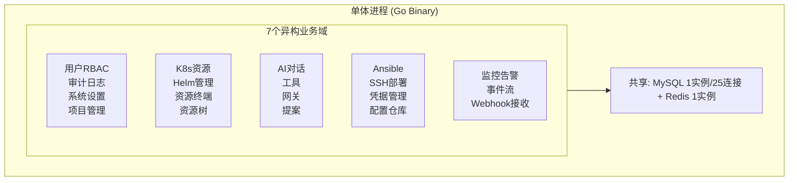

**7 个异构业务域共享同一进程和数据库**，这是当前架构最核心的问题。

### 2.4 分层架构

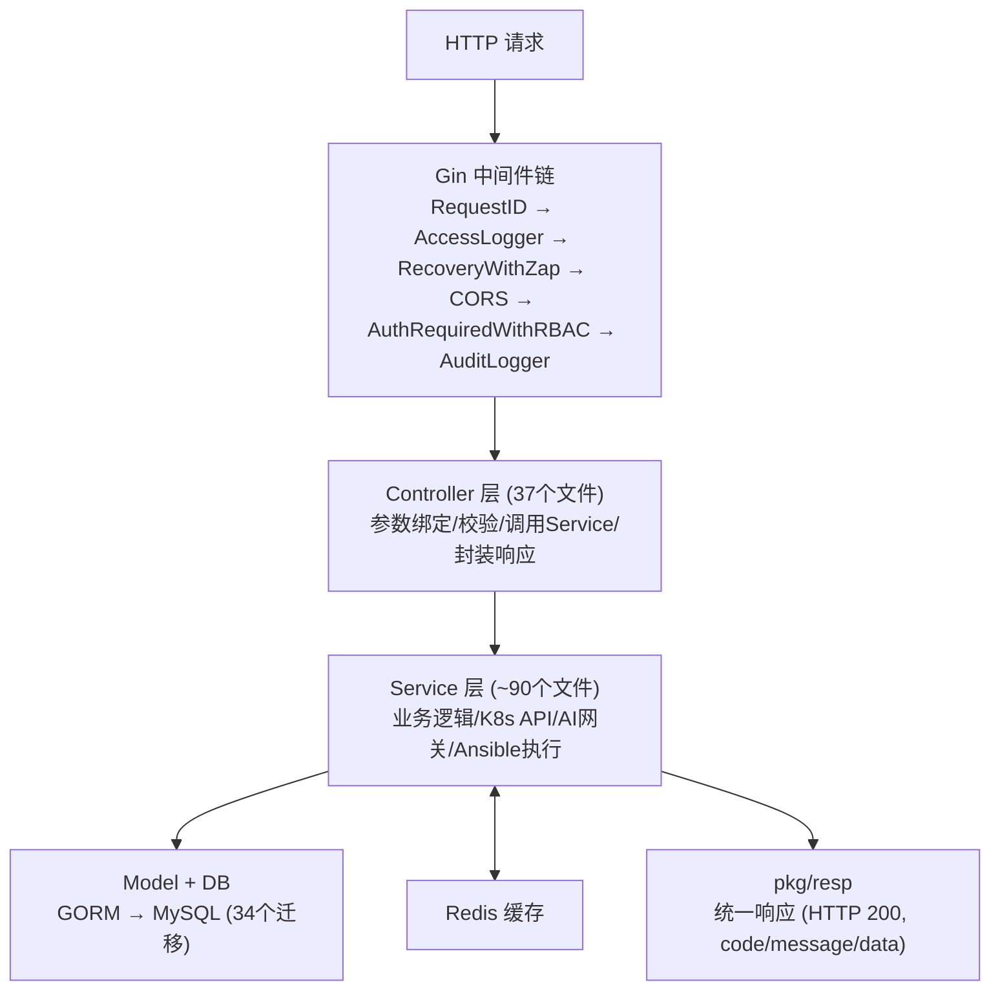

### 2.5 现有架构设计亮点

尽管存在单体瓶颈，当前架构仍有以下值得保留的设计：

| 设计 | 说明 | 改造后保留策略 |
|------|------|----------------|
| 依赖容器模式 | `router.Deps` 结构体聚合依赖，`DB==nil` 降级支持 | 每个微服务沿用此模式 |
| 自研 SQL 迁移 | embed 打包 + 文件名排序 + 事务幂等 | 每服务独立迁移目录 |
| 三层配置覆盖 | Default → YAML → 环境变量 | 每服务独立配置 |
| JWT 快照 + 实时刷新 | token 携带快照，中间件可选刷新 | 网关层统一鉴权 |
| 审计异步化 | 独立 5s 超时 + goroutine | 每服务保留异步审计 |
| 缓存按用户隔离 | sha256(uid\|method\|path\|query) | 每服务独立缓存 |
| K8s 控制器细粒度拆分 | 20 个子文件按资源类型拆分 | k8s-svc 内部保持 |
| 统一响应规范 | `ApiResponse[T]` 泛型 + 错误码体系 | 每服务沿用响应规范 |

---

## 3. 架构合理性诊断

### 3.1 量化评估

| 评估维度 | 评分 | 权重 | 加权分 | 核心问题 |
|----------|------|------|--------|----------|
| 可扩展性 | 3/10 | 25% | 0.75 | 单体不可水平扩展，所有业务域共享进程 |
| 可维护性 | 5/10 | 20% | 1.00 | 分层清晰但 Service 层臃肿（90 文件），领域边界模糊 |
| 性能瓶颈 | 4/10 | 20% | 0.80 | K8s API 调用阻塞主进程，AI 网关长连接占用 goroutine |
| 容错能力 | 3/10 | 15% | 0.45 | 无熔断/限流，单域故障拖垮全局，Redis 降级仅缓存层 |
| 可部署性 | 2/10 | 10% | 0.20 | 无 Dockerfile，无容器化，全量发布无法灰度 |
| 可观测性 | 5/10 | 10% | 0.50 | 有日志和审计，但无 Metrics/Tracing |
| **综合得分** | - | **100%** | **3.70/10** | **架构风险较高，亟需改造** |

### 3.2 核心问题清单

#### 问题 1：单体进程承载过多异构业务域（严重）

**现象**：单个 Go 进程同时承载 7 个完全异构的业务域，各自有不同的资源特征：

| 业务域 | 资源特征 | 风险 |
|--------|----------|------|
| K8s 资源管理 | 重 IO，频繁调用 K8s API | K8s API 超时阻塞 worker pool |
| AI 对话 | 长连接，CPU 密集，10 个 Model | AI 超时占用 goroutine 数分钟 |
| Ansible 部署 | SSH 长连接，分钟级阻塞 | 部署任务耗尽 goroutine |
| 监控告警 | 事件流，Webhook 突发流量 | 突发流量拖垮全局 |
| 用户 RBAC | 高频读写 | 与 AI 写入竞争 DB 连接 |

**影响**：任一域 OOM 或 goroutine 耗尽导致全局不可用。

#### 问题 2：Service 层领域边界模糊（高）

**现象**：90 个 Service 文件存在跨域直接依赖：

- `ai_tool_registry.go` 依赖 5 个子服务（k8s_service、cluster_registry、workload_action、namespace_summary、ai_resource_query）
- `ai_chat_service.go` 直接调用 K8s Service 获取资源信息
- `deploy_service.go` 依赖 Ansible 引擎 + SSH 服务 + K8s 注册

**影响**：无法按领域独立拆分；修改 K8s Service 可能影响 AI 对话功能。

#### 问题 3：数据库单点共享（高）

**现象**：

- 7 个业务域共享同一个 MySQL 实例（25 连接池）
- 34 个迁移文件混在一个 `schema_migrations` 表中
- AI 对话记录（高频写入）与 RBAC 权限（高频读取）竞争同一连接池

**影响**：AI 写入高峰期 RBAC 查询超时；无法对高频读域做只读副本扩展。

#### 问题 4：无服务间通信机制（中）

**现象**：所有业务逻辑在同一进程内通过函数调用完成，无 gRPC/消息队列等服务间通信基础设施。

**影响**：微服务改造成本极高，需要从零搭建服务间通信层。

#### 问题 5：无容器化部署规范（严重）

**现象**：项目中无 Dockerfile、无 docker-compose、无 K8s 部署清单。后端编译为单一二进制文件直接部署。

**影响**：无法弹性伸缩、滚动更新、灰度发布；环境不一致风险高；回滚困难。

#### 问题 6：无熔断限流机制（高）

**现象**：无 Sentinel/Hystrix 等熔断器，无限流中间件。

**影响**：AI 网关超时或 K8s API 慢响应会导致 Gin worker pool 耗尽，级联影响所有业务域。

#### 问题 7：可观测性不完整（中）

**现象**：有结构化日志和审计日志，但无 Prometheus metrics 暴露、无分布式追踪、无健康检查端点。

**影响**：生产环境无法监控服务健康状态，跨服务故障定位困难。

#### 问题 8：迁移文件版本号重复（低）

**现象**：存在重复版本号 `006`（audit_logs + projects）、`016`（step_overrides + credential_id）、`026`（preflight_ignores + task_log_step_key）。

**影响**：依赖文件名字符串排序保证顺序，实际可控但不规范，拆分后可能混淆。

---

## 4. 微服务架构符合性评估

### 4.1 核心原则校验

| 微服务原则 | 符合度 | 具体表现 | 不符合项 |
|------------|--------|----------|----------|
| **单一职责** | 20% | Controller 按资源拆分较好（20 个 K8s 子控制器），但 Service 层跨域依赖严重 | AI Service 直接调用 K8s Service；部署 Service 混合 SSH+Ansible+K8s |
| **服务自治** | 10% | 所有 Service 共享同一 MySQL 和 Redis；无独立数据存储 | 7 个业务域共享 1 个 DB 实例，34 个迁移混合管理 |
| **独立部署** | 0% | 单一二进制全量发布，无容器化 | 无 Dockerfile；无法独立部署任一业务域 |
| **去中心化治理** | 15% | 技术栈统一（Go+Gin），但配置中心化 | 配置文件全局管理，无配置中心；无服务注册发现 |
| **容错与弹性** | 10% | 有 panic recovery 和 Redis 降级，但无业务级容错 | 无熔断器；无限流；AI 超时无降级策略；无舱壁模式 |
| **可观测性** | 30% | 有结构化日志 + 审计日志，但缺关键能力 | 无 Prometheus metrics 暴露；无分布式追踪；无健康检查端点 |

### 4.2 差距清单

| # | 差距项 | 当前状态 | 微服务标准 | 改造优先级 |
|---|--------|----------|------------|------------|
| 1 | 服务拆分 | 单体进程 7 域共存 | 按业务域独立服务 | P0 |
| 2 | 数据库隔离 | 7 域共享 1 个 MySQL | 每服务独立数据库 | P0 |
| 3 | 容器化 | 无 Dockerfile | 每服务独立镜像 | P0 |
| 4 | 服务间通信 | 进程内函数调用 | gRPC/REST API | P1 |
| 5 | 服务注册发现 | 无 | Consul/etcd/K8s Service | P1 |
| 6 | 配置中心 | YAML 文件 + 环境变量 | Nacos/Apollo/ConfigMap | P1 |
| 7 | API 网关 | Gin 中间件链 | 独立网关（Traefik/Kong） | P2 |
| 8 | 分布式追踪 | 无 | OpenTelemetry/Jaeger | P2 |
| 9 | 熔断限流 | 无 | Sentinel-go | P2 |
| 10 | 消息队列 | 无 | RabbitMQ/NATS（事件驱动） | P3 |

---

## 5. 容器化部署优化方案

> **一致性提示（v1.7）**：本章为 v1.0 原始方案（5服务），经多轮评审后最终方案为 **11服务**（见附录L）。以下章节中引用的 `core-svc` 已拆分为 `auth-svc` + `platform-svc`（R1整改），`dashboard-bff` 已降级为网关中间件（R4整改），具体职责分配修正见 5.2.1 节，完整方案见附录L。

### 5.1 服务拆分边界

基于业务域分析和DDD限界上下文原则，最终拆分为 **11 个微服务**（8个模块组）：

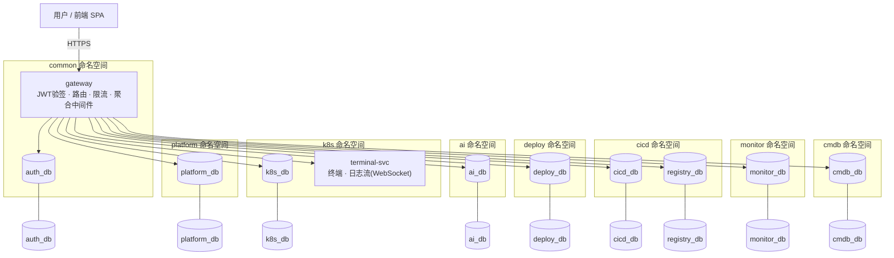

### 5.2 各服务职责范围

| 服务名 | 职责 | 迁移的 Controller | 迁移的 Service | 独立 DB | 预估镜像 |
|--------|------|-------------------|----------------|---------|----------|
| **core-svc** | 用户/角色/权限/审计/系统设置/项目管理 | auth_controller, user_controller, audit_controller, system_setting_controller, project_controller | rbac_service, audit_service, system_setting_service, project_service, captcha_service, login_attempt_service, mail_service, password_reset_service | rbac_db | ~30MB |
| **k8s-svc** | K8s 资源全生命周期/Helm/资源树/终端/日志 | k8s_controller (20 子文件), dashboard_controller, k8s_permission_audit_controller | k8s_service (全系列), k8s_workloads, k8s_pods, k8s_storage, k8s_config, k8s_batch_ops, k8s_manifest, k8s_nodes, k8s_cache, helm_*_service, dashboard_service, namespace_summary, workload_action_service, exec_session, pod_log_session, resource_export_policy_service | k8s_db | ~50MB |
| **ai-svc** | AI 对话/模型管理/工具调用/提案/路由 | ai_controller | ai_chat_service, ai_action_service, ai_conversation_service, ai_domain_services, ai_file_service, ai_gateway_service, ai_provider_service, ai_resource_query_service, ai_route_settings_service, ai_suggestion, ai_tool_registry, ai_tool_service, ai_workload_read_model | ai_db | ~35MB |
| **deploy-svc** | Ansible 部署/SSH/服务器管理/凭据/配置 | deploy_controller, deploy_config_controller, deploy_terminal_controller, automation_task_controller | deploy_service, deploy_config_service, deploy_plan_service, deploy_preflight_service, deploy_dryrun_service, deploy_ssh_service, deploy_addon_service, ansible_engine, ansible_executor, ansible_inventory, ansible_remote_runner, bootstrap, cluster_registry_service, cluster_validation, helm_master_preflight, task_service, task_store | deploy_db | ~40MB |
| **monitor-svc** | 告警规则/事件流/Webhook 接收/事件管理 | monitor_incident_controller, app_template_controller | monitor_incident_service, metrics_detector, metrics_provider, metrics_provider_manager, metrics_server_provider, prometheus_client, prometheus_provider, app_template_service | monitor_db | ~25MB |

### 5.2.1 职责分配修正（v1.1 评审修正）

> 经架构评审，5.2 原始表格存在以下职责分配问题，在此修正：

| 修正项 | 原方案 | 修正后 | 理由 |
|--------|--------|--------|------|
| 凭据管理 | deploy-svc | **core-svc** | 统一管理敏感资产，deploy-svc 和 k8s-svc 通过内部 API 获取（带缓存） |
| 审计日志 | core-svc 集中存储 | **各服务本地写入 + 异步同步** | 避免每次写操作都跨服务调用 core-svc；各服务写本地 audit_log 表，通过 NATS 异步同步到 core-svc 供集中查询 |
| app_template | monitor-svc | **k8s-svc** | 应用模板（YAML/Helm Chart）与 K8s 资源强关联，与监控无关 |
| dashboard | k8s-svc | **独立 dashboard-bff（网关层聚合）** | Dashboard 需聚合集群+告警+AI 多域数据，不应放在任一业务服务中 |
| cluster_registry | deploy-svc | **k8s-svc** | 集群连接信息（kubeconfig）主要被 k8s-svc 消费，deploy-svc 部署完成后通过 API 注册到 k8s-svc |

### 5.3 服务间通信方式

| 通信场景 | 方式 | 说明 |
|----------|------|------|
| core-svc → 其他服务 | JWT 透传 | 网关鉴权后，JWT 通过 Header 传递给下游服务 |
| ai-svc → k8s-svc | REST API | AI 工具需要查询 K8s 资源时，通过内部 API 调用 |
| deploy-svc → k8s-svc | REST API | 部署完成后注册集群到 k8s-svc |
| monitor-svc → core-svc | REST API | 事件归属查询集群/用户信息 |
| 异步事件 | NATS | 审计日志同步、部署状态变更通知、集群注册事件 |

#### 5.3.1 服务发现

采用 K8s 原生 DNS 服务发现，无需额外组件：

```
# 服务间通过 DNS 名称互相访问
core-svc.aiops.svc.cluster.local:8080     # HTTP
k8s-svc.aiops.svc.cluster.local:8080       # HTTP
ai-svc.aiops.svc.cluster.local:8080        # HTTP
deploy-svc.aiops.svc.cluster.local:8080    # HTTP
monitor-svc.aiops.svc.cluster.local:8080   # HTTP
```

#### 5.3.2 内部 API 认证

```
外部请求:  Client -> 网关(JWT验证) -> 下游服务
                                    Header: Authorization: Bearer <user-jwt>

内部调用:  ai-svc -> k8s-svc
           Header: X-Internal-Call: true
           Header: X-Service-Name: ai-svc
           Header: X-Internal-Token: <service-account-jwt>  ← 服务间专用
```

服务间专用 JWT 由 core-svc 签发，有效期 1h，自动续期。下游服务验证 `X-Internal-Token` 后跳过用户级 RBAC 校验。

#### 5.3.3 超时与重试策略

| 调用链 | 超时 | 重试次数 | 熔断阈值 |
|--------|------|----------|----------|
| 网关 -> 任意服务 | 30s | 0 | 5xx错误率 > 10% |
| ai-svc -> k8s-svc | 5s | 2 | 连续 10 次失败 |
| deploy-svc -> k8s-svc | 10s | 1 | 连续 5 次失败 |
| deploy-svc -> core-svc(凭据) | 3s | 2 | 连续 10 次失败 |
| monitor-svc -> core-svc | 3s | 2 | 连续 10 次失败 |
| dashboard-bff -> 各服务 | 3s/每个 | 0 | 部分失败返回 null |

#### 5.3.4 ai-svc 查询 K8s 资源的缓存策略

AI 工具高频查询 K8s 资源，直接跨服务调用延迟过高，采用本地缓存：

```
ai-svc 内部缓存层:
  key = clusterID + namespace + resourceType
  TTL = 30s
  miss -> GET k8s-svc/api/v1/internal/k8s/clusters/:id/pods -> 缓存 -> 返回
  hit -> 直接返回（减少 95% 的跨服务调用）
```

#### 5.3.5 Dashboard BFF 聚合

Dashboard 页面需要跨域数据，通过网关层 BFF 并行聚合：

```
dashboard-bff:
  并行调用:
    - k8s-svc:     GET /clusters          (timeout: 3s)
    - monitor-svc: GET /incidents/stats   (timeout: 3s)
    - ai-svc:      GET /suggestions/stats (timeout: 3s)
  聚合规则:
    - 全部成功 -> 合并返回
    - 某服务超时/失败 -> 该字段返回 null，响应头标记 X-Partial: true
    - 不阻塞整体响应
```

#### 5.3.6 分布式事务

跨服务操作采用 **Saga 模式（最终一致性）**，不使用 2PC：

```
示例：部署完成 -> 注册集群 -> 初始化监控

deploy-svc:
  Step 1: Ansible 部署成功（本地事务）
  Step 2: POST k8s-svc/api/v1/clusters（注册集群）
  Step 3: POST monitor-svc/api/v1/rules/init（初始化告警规则）

补偿策略:
  Step 3 失败 -> 不回滚 Step 1/2（集群已创建）
              -> 标记"监控初始化失败"，记录补偿任务
              -> 后台定时重试 Step 3
```

### 5.4 镜像构建标准

#### Dockerfile 模板（多阶段构建）

```dockerfile
# ============ Stage 1: Build ============
FROM golang:1.23-alpine AS builder

ARG SERVICE_NAME
ARG VERSION=dev

WORKDIR /build
COPY go.mod go.sum ./
RUN go mod download

COPY . .
RUN CGO_ENABLED=0 GOOS=linux go build \
    -ldflags="-s -w -X main.Version=${VERSION}" \
    -o /app/${SERVICE_NAME} \
    ./cmd/${SERVICE_NAME}/main.go

# ============ Stage 2: Runtime ============
FROM alpine:3.19

RUN apk add --no-cache ca-certificates tzdata && \
    cp /usr/share/zoneinfo/Asia/Shanghai /etc/localtime

WORKDIR /app
COPY --from=builder /app/${SERVICE_NAME} /app/service
COPY --from=builder /build/internal/db/migrations /app/migrations

USER 65532:65532
EXPOSE 8080
HEALTHCHECK --interval=10s --timeout=3s --retries=3 \
  CMD wget -q --spider http://localhost:8080/healthz || exit 1

ENTRYPOINT ["/app/service"]
```

#### 前端 Dockerfile

```dockerfile
# ============ Stage 1: Build ============
FROM node:20-alpine AS builder

WORKDIR /app
COPY package.json pnpm-lock.yaml ./
RUN corepack enable && pnpm install --frozen-lockfile

COPY . .
RUN pnpm build

# ============ Stage 2: Runtime ============
FROM nginx:alpine

COPY --from=builder /app/dist /usr/share/nginx/html
COPY nginx.conf /etc/nginx/conf.d/default.conf

EXPOSE 80
```

#### 镜像规范

| 规范项 | 要求 | 理由 |
|--------|------|------|
| 基础镜像 | alpine:3.19 或 distroless | 最小化攻击面 |
| 构建方式 | 多阶段构建 | 最终镜像不含编译工具 |
| 运行用户 | non-root (65532) | 安全合规 |
| 镜像大小 | 后端 < 50MB，前端 < 30MB | 快速拉取和启动 |
| 健康检查 | /healthz + /readyz 端点 | K8s 就绪/存活探针 |
| 优雅退出 | SIGTERM 处理 | 零中断滚动更新 |
| 迁移文件 | embed 到二进制 | 无外部文件依赖 |
| 镜像标签 | semver (v1.2.3) + git sha | 版本可追溯 |

### 5.5 多服务编排方案

#### 开发/测试环境（docker-compose）

```yaml
version: '3.8'
services:
  # ---- 基础设施 ----
  mysql:
    image: mysql:8.0
    environment:
      MYSQL_ROOT_PASSWORD: rootpass
    volumes:
      - mysql_data:/var/lib/mysql
    ports: ["3306:3306"]

  redis:
    image: redis:7-alpine
    volumes:
      - redis_data:/data
    ports: ["6379:6379"]

  # ---- API 网关 ----
  gateway:
    image: traefik:v3.0
    command:
      - --providers.docker=true
      - --providers.docker.exposedbydefault=false
      - --entrypoints.web.address=:80
    ports: ["80:80"]
    volumes:
      - /var/run/docker.sock:/var/run/docker.sock

  # ---- 业务服务 ----
  core-svc:
    build:
      context: ./backend
      args:
        SERVICE_NAME: core
    environment:
      - MYSQL_DSN=root:rootpass@tcp(mysql:3306)/rbac_db?charset=utf8mb4
      - JWT_SECRET=${JWT_SECRET}
      - REDIS_ADDR=redis:6379
    depends_on: [mysql, redis]
    labels:
      - traefik.enable=true
      - traefik.http.routers.core.rule=PathPrefix(`/api/v1/auth`,`/api/v1/users`,`/api/v1/roles`)
      - traefik.http.services.core.loadbalancer.server.port=8080

  k8s-svc:
    build:
      context: ./backend
      args:
        SERVICE_NAME: k8s
    environment:
      - MYSQL_DSN=root:rootpass@tcp(mysql:3306)/k8s_db?charset=utf8mb4
      - JWT_SECRET=${JWT_SECRET}
      - REDIS_ADDR=redis:6379
    depends_on: [mysql, redis]
    labels:
      - traefik.enable=true
      - traefik.http.routers.k8s.rule=PathPrefix(`/api/v1/clusters`,`/api/v1/k8s`)
      - traefik.http.services.k8s.loadbalancer.server.port=8080

  ai-svc:
    build:
      context: ./backend
      args:
        SERVICE_NAME: ai
    environment:
      - MYSQL_DSN=root:rootpass@tcp(mysql:3306)/ai_db?charset=utf8mb4
      - AI_ENABLED=true
      - JWT_SECRET=${JWT_SECRET}
      - REDIS_ADDR=redis:6379
    depends_on: [mysql, redis]
    labels:
      - traefik.enable=true
      - traefik.http.routers.ai.rule=PathPrefix(`/api/v1/ai`)
      - traefik.http.services.ai.loadbalancer.server.port=8080

  # deploy-svc, monitor-svc 同理...

  # ---- 前端 ----
  frontend:
    build: ./frontend
    labels:
      - traefik.enable=true
      - traefik.http.routers.frontend.rule=PathPrefix(`/`)
      - traefik.http.services.frontend.loadbalancer.server.port=80

volumes:
  mysql_data:
  redis_data:
```

#### 生产环境（K8s 编排）

每个服务一个 Deployment + Service + HPA：

```yaml
# 以 k8s-svc 为例
apiVersion: apps/v1
kind: Deployment
metadata:
  name: k8s-svc
  namespace: aiops
spec:
  replicas: 3                          # 水平扩展
  strategy:
    type: RollingUpdate
    rollingUpdate:
      maxSurge: 1
      maxUnavailable: 0                 # 零中断更新
  selector:
    matchLabels:
      app: k8s-svc
  template:
    metadata:
      labels:
        app: k8s-svc
    spec:
      containers:
      - name: k8s-svc
        image: registry.example.com/aiops/k8s-svc:v1.2.3
        ports:
        - containerPort: 8080
        resources:
          requests: { cpu: 200m, memory: 256Mi }
          limits: { cpu: 1000m, memory: 512Mi }
        livenessProbe:
          httpGet: { path: /healthz, port: 8080 }
          initialDelaySeconds: 5
          periodSeconds: 10
        readinessProbe:
          httpGet: { path: /readyz, port: 8080 }
          initialDelaySeconds: 3
          periodSeconds: 5
        env:
        - name: MYSQL_DSN
          valueFrom:
            secretKeyRef:
              name: k8s-svc-db-secret
              key: dsn
        - name: JWT_SECRET
          valueFrom:
            secretKeyRef:
              name: jwt-secret
              key: secret
---
apiVersion: v1
kind: Service
metadata:
  name: k8s-svc
  namespace: aiops
spec:
  selector:
    app: k8s-svc
  ports:
  - port: 8080
    targetPort: 8080
---
apiVersion: autoscaling/v2
kind: HorizontalPodAutoscaler
metadata:
  name: k8s-svc
  namespace: aiops
spec:
  scaleTargetRef:
    apiVersion: apps/v1
    kind: Deployment
    name: k8s-svc
  minReplicas: 2
  maxReplicas: 10
  metrics:
  - type: Resource
    resource:
      name: cpu
      target:
        type: Utilization
        averageUtilization: 70
```

---

## 6. 微服务改造分步实施路径

### Phase 1：容器化基础（1-2 周）

**目标**：为当前单体应用建立容器化能力，不改变架构。

| 步骤 | 内容 | 验收标准 | 产出物 |
|------|------|----------|--------|
| 1.1 | 创建后端 Dockerfile（多阶段构建） | 镜像 < 80MB，启动正常 | `backend/Dockerfile` |
| 1.2 | 添加 `/healthz` + `/readyz` 健康检查端点 | K8s 探针正常探测 | 后端代码修改 |
| 1.3 | 验证 SIGTERM 优雅退出（已有） | 滚动更新零中断 | 验证报告 |
| 1.4 | 创建前端 Dockerfile（Nginx 静态托管） | 前端独立部署 | `frontend/Dockerfile` |
| 1.5 | 创建 `docker-compose.yml` 一键启动 | 开发环境一键启动 | `docker-compose.yml` |
| 1.6 | 创建 `.dockerignore` 优化构建上下文 | 构建上下文 < 10MB | `.dockerignore` |

### Phase 2：领域模块解耦（4-6 周）

**目标**：在单体内部按领域重构代码结构，为拆分做准备。

| 步骤 | 内容 | 验收标准 | 产出物 |
|------|------|----------|--------|
| 2.1 | 重构 Service 层包结构，按 5 个领域分包 | 领域包无跨域直接依赖 | 代码重构 |
| 2.2 | 定义领域间 Go interface，消除直接依赖 | AI 不直接调 K8s Service | interface 定义 |
| 2.3 | 数据库按域分库（同实例不同 DB） | 5 个独立 DB，迁移文件分流 | DB 脚本 |
| 2.4 | 引入进程内事件总线（观察者模式） | 领域间通过事件解耦 | eventbus 包 |
| 2.5 | 统一迁移文件版本号（消除重复 006/016/026） | 无重复版本号 | 迁移文件重命名 |

### Phase 3：服务拆分（3-4 周）

**目标**：按优先级逐个拆分服务，每次拆分后独立部署验证。

| 步骤 | 拆分服务 | 拆分顺序理由 | 验收标准 |
|------|----------|-------------|----------|
| 3.1 | monitor-svc | 独立性最强，不涉及核心链路 | Webhook 接收独立，事件流正常 |
| 3.2 | deploy-svc | 解决 Ansible/SSH 长连接阻塞，收益最大 | Ansible 部署不阻塞其他 API |
| 3.3 | ai-svc | 解决 AI 网关超时阻塞 worker pool | AI 超时不影响 K8s 资源管理 |
| 3.4 | k8s-svc + terminal-svc | 依赖最多，含20子控制器+WebSocket长连接，拆分复杂 | K8s 资源管理+终端独立运行 |
| 3.5 | auth-svc + platform-svc | 认证与平台配置是所有服务的基础依赖，最后拆分 | 独立部署，其他服务通过 API 鉴权 |

**每次拆分的标准流程**：

1. 创建 `cmd/<service-name>/main.go` 独立入口
2. 提取该服务的配置、路由、依赖
3. 定义与其他服务的 API 接口（gRPC 或 REST）
4. 数据库迁移文件分流到该服务
5. 创建独立 Dockerfile
6. 在 docker-compose 中独立部署
7. 验证功能完整性

### Phase 4：治理增强（2-3 周）

**目标**：补齐微服务治理能力。

| 步骤 | 内容 | 验收标准 | 产出物 |
|------|------|----------|--------|
| 4.1 | 部署 API 网关（Traefik） | 统一鉴权、限流、路由 | 网关配置 |
| 4.2 | 引入 Prometheus metrics | 每服务暴露 `/metrics` | metrics 中间件 |
| 4.3 | 引入 OpenTelemetry 分布式追踪 | 跨服务调用链可追踪 | tracing 中间件 |
| 4.4 | 实现熔断限流（sentinel-go） | AI 超时自动熔断 | 熔断器配置 |
| 4.5 | 部署 Grafana 监控面板 | 核心指标可视化 | Grafana Dashboard |

---

## 7. 改造后预期收益验证标准

### 7.1 量化指标

| 指标 | 当前状态 | 改造后目标 | 验证方式 |
|------|----------|------------|----------|
| 部署时间 | 全量发布 5-10min | 单服务滚动更新 < 60s | K8s rollout 计时 |
| 可用性 | 单点故障=全局不可用 | 单服务故障不影响其他域 | 混沌测试：kill ai-svc，验证 k8s-svc 正常 |
| 扩展性 | 无法水平扩展 | K8s 资源管理可独立扩容 3 副本 | 压测：3 副本 QPS 提升 3 倍 |
| 镜像大小 | N/A（无镜像） | 每服务 < 50MB | `docker images` 检查 |
| 故障恢复 | 全量重启 5-10min | 单服务重启 < 30s | K8s 自愈计时 |
| 灰度能力 | 无 | 按服务独立灰度 | K8s Canary 发布验证 |
| AI 超时影响 | 阻塞 Gin worker pool | 熔断降级，其他 API 正常 | 压测：AI 超时期间 K8s API 响应正常 |
| DB 连接竞争 | 25 连接池共享 | 每服务独立连接池 | 监控连接池使用率 |

### 7.2 验证检查清单

#### Phase 1 验收

- [ ] `docker-compose up` 一键启动全部服务
- [ ] 后端镜像 < 80MB
- [ ] 前端镜像 < 30MB
- [ ] `/healthz` 返回 200
- [ ] SIGTERM 后 5s 内优雅退出
- [ ] 现有功能全部正常

#### Phase 2 验收

- [ ] Service 层按 5 个领域分包
- [ ] 领域间无直接 import 依赖
- [ ] 5 个独立数据库（rbac_db / k8s_db / ai_db / deploy_db / monitor_db）
- [ ] 迁移文件按服务分流
- [ ] 现有功能全部正常

#### Phase 3 验收（每拆分一个服务验证一次）

- [ ] 服务独立编译为二进制
- [ ] 服务独立 Dockerfile 构建
- [ ] 服务独立 docker-compose 部署
- [ ] 服务间 API 调用正常
- [ ] 功能完整性验证通过

#### Phase 4 验收

- [ ] API 网关统一路由
- [ ] Prometheus 采集到 metrics
- [ ] Grafana 面板展示核心指标
- [ ] 熔断器在 AI 超时时触发
- [ ] 分布式追踪链路完整

---

## 8. 风险评估与应对措施

| 风险 | 等级 | 影响范围 | 应对措施 |
|------|------|----------|----------|
| 拆分过程中功能回归 | 高 | 全局 | 每次拆分后执行完整回归测试 |
| 服务间网络延迟 | 中 | 跨服务调用 | 内部调用使用 gRPC，连接池复用 |
| 数据一致性 | 中 | 跨域事务 | 引入 Saga 模式或最终一致性 |
| 运维复杂度增加 | 中 | 运维团队 | 提供 docker-compose 一键启动 + 详细文档 |
| 迁移文件版本冲突 | 低 | 数据库迁移 | Phase 2 统一重命名版本号 |
| 配置分散 | 中 | 多服务配置 | 使用 K8s ConfigMap 统一管理 |

---

## 9. 架构治理与非功能性保障

### 9.1 技术债务评估矩阵

> 对第 3 章核心问题的补充：按债务类别分类量化，形成优先级矩阵。

| 债务类别 | 具体债务 | 严重性(1-5) | 影响范围(1-3) | 风险分 | 修复阶段 |
|----------|----------|:-----------:|:------------:|:------:|----------|
| 架构债务 | 单体进程承载7个异构业务域 | 5 | 3 | **15** | Phase 2-3 |
| 架构债务 | 无容器化部署规范 | 5 | 3 | **15** | Phase 1 |
| 架构债务 | 7域共享MySQL单实例 | 4 | 3 | **12** | Phase 2 |
| 部署债务 | 无灰度/蓝绿发布能力 | 4 | 3 | **12** | Phase 1 |
| 代码债务 | Service层跨域依赖(ai_tool_registry) | 4 | 2 | **8** | Phase 2 |
| 代码债务 | 90个Service文件领域边界模糊 | 3 | 3 | **9** | Phase 2 |
| 测试债务 | 无集成测试框架 | 4 | 2 | **8** | Phase 1 |
| 部署债务 | 无回滚机制 | 4 | 2 | **8** | Phase 1 |
| 可观测债务 | 无健康检查端点 | 4 | 2 | **8** | Phase 1 |
| 架构债务 | 无服务间通信机制 | 4 | 2 | **8** | Phase 2 |
| 性能债务 | AI超时阻塞Gin worker pool | 4 | 2 | **8** | Phase 3 |
| 安全债务 | 凭据加密算法未明确 | 3 | 2 | 6 | Phase 2 |
| 可观测债务 | 无Prometheus metrics | 3 | 2 | 6 | Phase 4 |
| 可观测债务 | 无分布式追踪 | 3 | 2 | 6 | Phase 4 |
| 测试债务 | 无压力测试 | 3 | 2 | 6 | Phase 4 |
| 代码债务 | 迁移文件版本号重复(006/016/026) | 2 | 1 | 2 | Phase 2 |
| 安全债务 | CORS中间件用于生产环境 | 2 | 1 | 2 | Phase 4 |

**风险分 = 严重性 x 影响范围，>= 12 为紧急债务，须在 Phase 1-2 优先偿还。**

### 9.2 遗漏的架构设计原则

第 4 章已校验 6 项微服务原则，以下补充遗漏的架构设计原则：

| 原则 | 当前状态 | 目标状态 | 改造措施 |
|------|----------|----------|----------|
| **高可用设计** | 单点部署，无冗余 | 多副本 + 健康探针 + 自动恢复 | 每服务 >= 2 副本；liveness/readiness 探针；PodDisruptionBudget |
| **云原生适配** | 二进制部署，无容器化 | 容器化 + 声明式 + GitOps | Dockerfile + K8s Manifest + 配置外置（12-Factor） |
| **零信任安全** | 内网信任，CORS硬编码 | 服务间 mTLS + 最小权限 + 动态凭据 | Traefik mTLS；RBAC 细粒度；凭据轮换 |
| **可观测性** | 仅日志 + 审计 | 日志 + 指标 + 追踪 + 健康 | Loki + Prometheus + Jaeger + /healthz |
| **弹性设计** | 无熔断/限流 | 熔断 + 限流 + 降级 + 重试 | sentinel-go + 超时控制 + 降级策略 |
| **数据安全** | 凭据明文传输风险 | 传输加密(TLS) + 存储加密(AES-256-GCM) | 全链路 TLS；at-rest 加密；密钥轮换 |

### 9.3 架构防腐策略

改造期间防止架构退化的防腐措施：

#### 9.3.1 绞杀者模式（Strangler Fig）

```
改造路径：不一次性替换，而是逐步绞杀旧功能

Step 1: 网关层路由新增功能到新服务，旧功能仍走单体
Step 2: 逐个功能域迁移到新服务，网关切换路由
Step 3: 旧单体中已迁移的代码标记为 Deprecated
Step 4: 确认新服务稳定后删除旧代码
Step 5: 全部迁移完成后下线旧单体

关键原则：任何时刻都有完整的回滚能力
```

#### 9.3.2 防腐层（Anti-Corruption Layer）

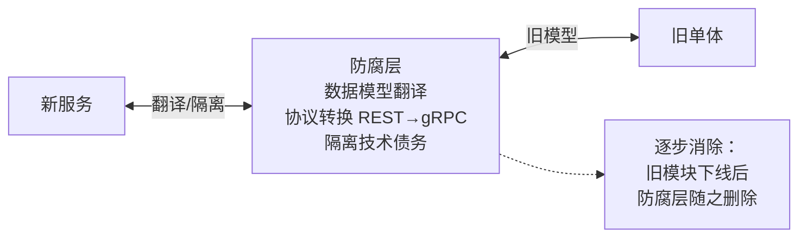

#### 9.3.3 数据双写过渡

```mermaid
graph LR
    OLD["旧库 (单库)"] -->|同步写入| NEW["新库 (分库)"]
    OLD -->|读取走旧库| APP1["应用 (灰度前)"]
    NEW -->|读取走新库 (灰度切换)| APP2["应用 (灰度后)"]
    OLD <-->|数据校验 (定时任务)<br/>对比行数/内容一致性| NEW
```

**切换步骤**：
1. 双写期（新库作为副本，不对外提供读取）
2. 灰度读（10%流量读新库，90%读旧库）
3. 全量读（100%读新库，旧库仅写）
4. 停旧库（确认无差异后停止旧库写入）

#### 9.3.4 特性开关（Feature Flag）

| 场景 | 开关名 | 默认值 | 说明 |
|------|--------|--------|------|
| 新服务路由 | `route_to_new_k8s_svc` | false | 网关层控制是否路由到新服务 |
| 分库读取 | `read_from_split_db` | false | 控制是否从分库读取 |
| gRPC内部调用 | `use_grpc_internal` | false | 控制是否使用gRPC替代REST内部调用 |
| 熔断降级 | `circuit_breaker_enabled` | false | 控制是否启用熔断器 |

### 9.4 非功能性需求架构保障

#### 9.4.1 性能架构保障

| 指标 | 目标值 | 架构级支撑 |
|------|--------|------------|
| API 吞吐量 | >= 1000 QPS（单服务） | 无状态服务水平扩展；连接池复用；Redis缓存热点数据 |
| API 延迟 P99 | < 200ms（K8s资源）/ < 2s（AI对话首字） | gRPC内部调用；批量查询接口；AI流式SSE |
| WebSocket并发 | >= 500连接/实例 | terminal-svc独立隔离；连接池上限控制 |
| 部署并发 | >= 3个集群同时部署 | goroutine pool信号量；deploy-svc独立扩展 |
| 数据库查询 | < 50ms（单表）/ < 100ms（JOIN） | 分库后单库表数量降低；索引优化；读写分离预留 |

#### 9.4.2 可靠性设计

| 设计项 | 方案 | 实施阶段 |
|--------|------|----------|
| **多副本** | 每服务 >= 2 副本，PodDisruptionBudget 保证最少1个可用 | Phase 1 |
| **健康探针** | liveness(存活) + readiness(就绪) + startup(启动) | Phase 1 |
| **故障自愈** | K8s自动重启崩溃Pod；HPA自动扩缩容 | Phase 1 |
| **滚动更新** | maxSurge=1, maxUnavailable=0，零中断更新 | Phase 1 |
| **优雅退出** | SIGTERM -> 停止接收新请求 -> 等待处理中请求 -> 退出 | Phase 1 |
| **熔断降级** | sentinel-go熔断器 + 降级返回默认值 | Phase 4 |
| **重试策略** | 指数退避重试（1s -> 2s -> 4s），最多3次 | Phase 4 |
| **超时控制** | 网关30s / 服务间5s / DB查询3s | Phase 2 |
| **多活容灾（远期）** | 跨可用区部署；MySQL主从；Redis哨兵 | Phase 4+ |

#### 9.4.3 安全性架构改造

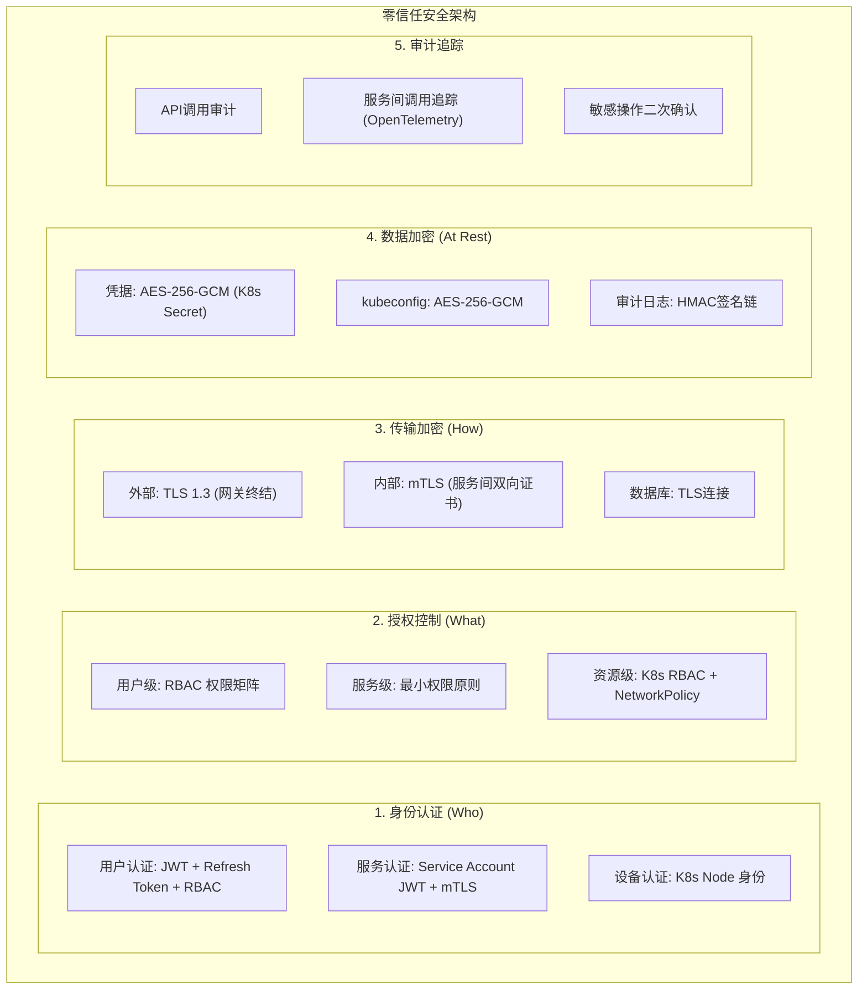

#### 9.4.4 可观测性体系架构集成

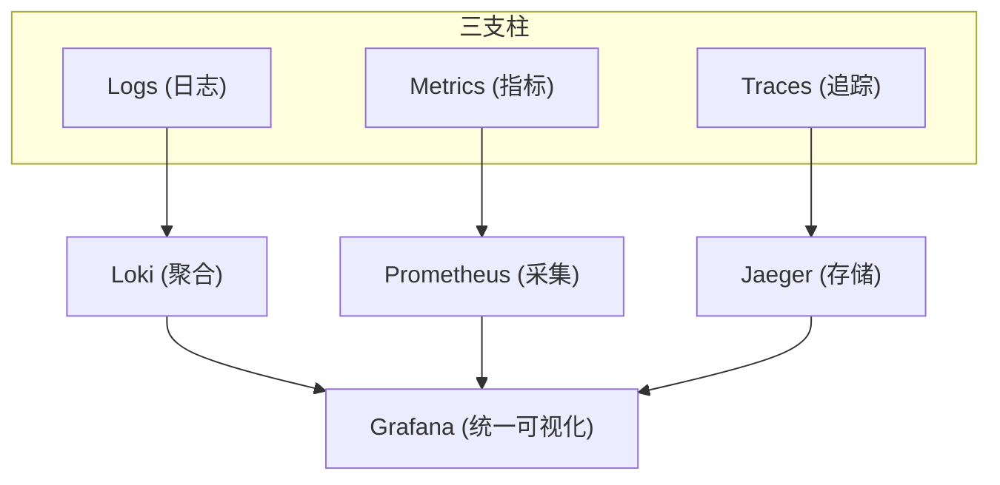

**各服务暴露端点**：
  /healthz  → 存活探针（K8s liveness）
  /readyz   → 就绪探针（K8s readiness）
  /metrics  → Prometheus指标（请求量/延迟/错误率/goroutine数）
  /debug/pprof → Go性能分析（仅内网访问）
```

| 指标分类 | 关键指标 | 告警阈值 |
|----------|----------|----------|
| 黄金信号 | 请求量(QPS) / 延迟(P99) / 错误率 / 饱和度 | 错误率 > 1% 或 P99 > 500ms |
| 资源指标 | CPU / 内存 / goroutine数 / GC耗时 | 内存 > 80% 或 goroutine > 10000 |
| 业务指标 | 集群数 / AI对话数 / 部署任务数 / 活跃用户 | 集群数突降 > 20% |
| 基础设施 | DB连接池使用率 / Redis命中率 / NATS消息积压 | 连接池 > 80% 或命中率 < 70% |

### 9.5 技术栈选型合理性验证

| 技术选型 | 合理性 | 替代方案 | 验证结论 |
|----------|--------|----------|----------|
| Gin (Web框架) | ✅ 合适 | Echo, Fiber | Gin生态成熟，项目已深度使用，不换 |
| GORM (ORM) | ✅ 合适 | sqlx, ent | GORM功能完备，已深度使用 |
| Traefik (网关) | ✅ 合适 | Kong, Nginx | Traefik原生K8s支持，配置简洁 |
| NATS (消息队列) | ✅ 合适 | RabbitMQ, Kafka | NATS轻量级，Go原生，匹配项目规模 |
| Prometheus (监控) | ✅ 合适 | Datadog, Zabbix | 行业标准，开源免费 |
| Jaeger (追踪) | ✅ 合适 | Zipkin, SkyWalking | CNCF标准，OpenTelemetry兼容 |
| sentinel-go (熔断) | ✅ 合适 | Hystrix(go), Resilience4j | 阿里开源，Go原生 |
| MySQL (数据库) | ✅ 合适 | PostgreSQL | 已深度使用，不换 |
| Redis (缓存) | ✅ 合适 | Memcached | 已有，保留 |
| gRPC (内部通信) | ⚠️ 需验证 | REST+HTTP/2 | gRPC适合高频调用，但增加Protobuf维护成本。建议仅ai-svc->k8s-svc使用gRPC，其他保持REST |

### 9.6 跨团队协作架构治理

| 治理机制 | 说明 | 实施阶段 |
|----------|------|----------|
| **API契约管理** | 使用OpenAPI 3.0规范定义所有服务API，Protobuf IDL定义gRPC接口。契约变更需通过架构Review | Phase 2 |
| **架构决策记录(ADR)** | 每个重要架构决策记录为ADR文档（Architecture Decision Record），包含上下文/决策/后果 | Phase 1 |
| **架构Review机制** | 每两周一次架构Review，审查跨服务API变更、数据模型变更、技术选型变更 | Phase 2 |
| **代码规范一致性** | 统一Go代码规范(golangci-lint)、统一错误处理模式(pkg/resp)、统一日志格式(zap) | Phase 1 |
| **Monorepo策略** | 推荐Monorepo + Go workspace，避免多仓库的依赖管理复杂度 | Phase 1 |
| **CI/CD流水线** | 每个服务独立CI流水线(lint+test+build)；CD通过GitOps(ArgoCD) | Phase 1 |
| **环境管理** | dev -> staging -> prod 三环境，配置通过K8s ConfigMap/Secret隔离 | Phase 1 |

---

## 10. ROI分析与落地指南

### 10.1 改造成本量化

| 成本项 | 人力(人周) | 基础设施 | 说明 |
|--------|-----------|----------|------|
| Phase 1 容器化 | 3-4 | Traefik x2 + 前端Nginx | Dockerfile + compose + 健康检查 |
| Phase 2 领域解耦 | 6-8 | NATS x1 | 90个Service重构 + 分库 + 事件总线 |
| Phase 3 服务拆分 | 8-10 | 每服务2副本 = 10Pod | 5个服务逐个拆分 + 数据迁移 |
| Phase 4 治理增强 | 4-5 | Prometheus + Grafana + Jaeger | 监控 + 追踪 + 熔断 |
| **合计** | **21-27人周** | **7.5C/13.8GB/181GB** | **约5-7个月（1人）/ 2-3个月（3人团队）** |

### 10.2 业务价值量化

| 价值项 | 当前状态 | 改造后 | 年化收益 |
|--------|----------|--------|----------|
| 部署频率 | 每月1-2次全量发布 | 每日可独立发布 | 交付效率提升10x |
| 故障恢复 | 5-10min全量重启 | <30s单服务自愈 | MTTR降低90% |
| AI超时影响 | 全局API不可用 | 熔断降级，其他正常 | 故障范围缩小80% |
| 扩展能力 | 无法水平扩展 | 按需独立扩容 | 资源利用率提升40% |
| 灰度发布 | 无 | 按服务独立灰度 | 发布风险降低70% |
| 可观测性 | 日志+审计 | 日志+指标+追踪+面板 | 故障定位时间降低60% |

### 10.3 ROI计算

```
投入:
  开发人力: 25人周 x 5000元/人周 = 12.5万元
  基础设施增量: 7.5C/13.8GB/181GB ≈ 2万元/年
  总投入: 约14.5万元

产出(年化):
  交付效率提升: 节省发布等待时间 ≈ 10万元/年
  故障恢复降低: MTTR从10min降到30s ≈ 5万元/年
  资源利用率提升: 减少过度配置 ≈ 3万元/年
  总产出: 约18万元/年

ROI = (年化产出 - 年化投入) / 年化投入 = (18 - 2) / 14.5 ≈ 110%
回本周期: 约10个月
```

### 10.4 风险预案更新（补充第8章）

| 风险 | 等级 | 触发条件 | 应对预案 | 回滚方案 |
|------|------|----------|----------|----------|
| Phase 1 容器化失败 | 中 | 镜像构建/运行异常 | 回退到二进制部署 | 保留原有部署脚本，1h内回退 |
| Phase 2 分库数据丢失 | 高 | 迁移脚本执行错误 | 立即停止迁移，使用旧库 | mysqldump备份恢复，30min内回退 |
| Phase 3 服务拆分后功能异常 | 高 | 某服务拆分后功能不正常 | 网关路由切回旧单体 | 特性开关`route_to_new_xxx_svc=false`，1min内回退 |
| Phase 4 监控系统不可用 | 低 | Prometheus/Grafana故障 | 不影响业务功能 | 修复后恢复，无需回滚 |
| 改造周期超预期 | 中 | 实际工期超过预估30% | 重新评估优先级，砍非核心项 | 优先保障Phase 1-2，Phase 3-4延后 |
| 团队人员变动 | 中 | 核心开发人员离职 | 确保ADR文档完整，知识不依赖个人 | 补充人员，延长工期 |

### 10.5 落地检查清单

**启动前检查（Gate 0）**：
- [ ] 本文档已通过架构评审
- [ ] R1-R6 整改要求已纳入实施计划
- [ ] 团队已确认技术栈选型（第9.5节）
- [ ] ADR文档模板已准备
- [ ] CI/CD流水线基础已就绪

**Phase 完成检查**：
- [ ] Phase 1: 容器化完成，docker-compose一键启动，/healthz正常
- [ ] Phase 2: 领域解耦完成，无跨域import，分库完成，事件总线运行
- [ ] Phase 3: 5个服务独立部署，R1-R6全部验收通过
- [ ] Phase 4: 监控/追踪/熔断全部就绪，Grafana面板可观测

---

## 附录

### A. 当前项目文件统计

| 层级 | 文件数 | 代码行数（估算） |
|------|--------|-----------------|
| 后端 Controller | 47 | ~8000 |
| 后端 Service | ~90 | ~15000 |
| 后端 Model | 21 | ~2000 |
| 后端 Middleware | 7 | ~800 |
| 后端 Migration | 34 | ~3000 |
| 前端 Pages | ~60 | ~12000 |
| 前端 Components | 20+ | ~3000 |
| 前端 Services | 15 | ~1500 |

### B. 建议的技术选型

| 领域 | 推荐技术 | 理由 |
|------|----------|------|
| API 网关 | Traefik v3 | 原生 K8s 支持，自动服务发现 |
| 服务间通信 | gRPC + Protocol Buffers | 高性能，类型安全 |
| 配置中心 | K8s ConfigMap + Secret | 无额外组件，K8s 原生 |
| 监控 | Prometheus + Grafana | 行业标准 |
| 追踪 | OpenTelemetry + Jaeger | CNCF 标准 |
| 熔断限流 | sentinel-go | 阿里开源，Go 原生 |
| 消息队列（可选） | NATS | 轻量级，Go 原生 |
| 容器编排 | K8s（已有） | 平台自身就是 K8s 管理平台 |

### C. 参考文档

- [K8s-Platform 后端架构深度分析](#) - 内部分析报告
- [Twelve-Factor App](https://12factor.net/) - 微服务设计原则
- [Microservices Patterns](https://microservices.io/) - Chris Richardson 微服务模式
- [CNCF Cloud Native Trail Map](https://github.com/cncf/trailmap) - CNCF 云原生路线图

---

## 附录 D：前端改造方案

### D.1 改造策略：网关统一入口（前端零改动）

前端 **不需要** 为每个微服务配置不同的 API 地址。通过 Traefik 网关按路径前缀路由到对应服务，前端继续使用统一的 `/api/v1` 基础路径。

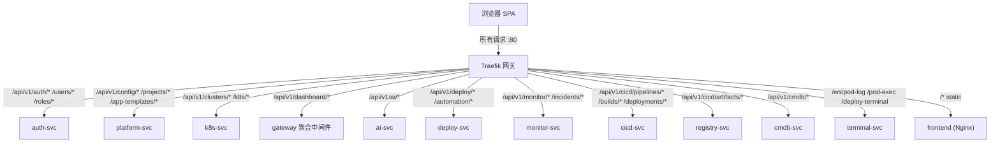

### D.2 前端变更项

| 变更项 | 说明 | 改动量 |
|--------|------|--------|
| API 基础地址 | 不变，统一 `/api/v1` | 零改动 |
| 请求拦截器 | 不变，JWT 仍存 localStorage | 零改动 |
| WebSocket/SSE | 网关透传 WebSocket，前端无感知 | 零改动 |
| 错误处理 | 增加 503/502 处理（服务不可用时友好提示） | 小改动 |
| 前端 Dockerfile | 新增 Nginx 镜像构建 | 新增文件 |

### D.3 WebSocket 路由说明

Traefik 原生支持 WebSocket 透传，无需额外配置：

```yaml
# Traefik 自动处理 WebSocket Upgrade
# /ws/pod-log?clusterId=1&namespace=default -> k8s-svc:8080
# 前端代码 useWebSocket('/ws/pod-log?...') 无需修改
```

---

## 附录 E：数据迁移方案

### E.1 迁移步骤

```
Step 1: 创建 9 个新数据库
  CREATE DATABASE auth_db CHARACTER SET utf8mb4;
  CREATE DATABASE platform_db CHARACTER SET utf8mb4;
  CREATE DATABASE k8s_db CHARACTER SET utf8mb4;
  CREATE DATABASE ai_db CHARACTER SET utf8mb4;
  CREATE DATABASE deploy_db CHARACTER SET utf8mb4;
  CREATE DATABASE monitor_db CHARACTER SET utf8mb4;
  CREATE DATABASE cicd_db CHARACTER SET utf8mb4;
  CREATE DATABASE registry_db CHARACTER SET utf8mb4;
  CREATE DATABASE cmdb_db CHARACTER SET utf8mb4;

Step 2: 按表导出数据
  mysqldump -u root -p old_db users roles permissions role_permissions user_roles audit_logs > auth.sql
  mysqldump -u root -p old_db clusters system_settings projects app_templates > platform.sql
  mysqldump -u root -p old_db k8s_permission_audits manifest_apply_records > k8s.sql
  mysqldump -u root -p old_db ai_conversations ai_messages ai_models ai_providers ai_action_proposals ai_action_executions ai_tool_calls ai_uploaded_files ai_usage_records ai_route_settings > ai.sql
  mysqldump -u root -p old_db deploy_servers deploy_configs deploy_plans ssh_credentials deploy_addons > deploy.sql
  mysqldump -u root -p old_db monitor_incidents monitor_rules > monitor.sql

Step 3: 导入到各自数据库
  mysql -u root -p auth_db < auth.sql
  mysql -u root -p platform_db < platform.sql
  mysql -u root -p k8s_db < k8s.sql
  mysql -u root -p ai_db < ai.sql
  mysql -u root -p deploy_db < deploy.sql
  mysql -u root -p monitor_db < monitor.sql
  # cicd_db / registry_db / cmdb_db 为新建库，无历史数据迁移

Step 4: 验证数据完整性（行数对比）
  SELECT COUNT(*) FROM old_db.users;  -- 对比
  SELECT COUNT(*) FROM auth_db.users;  -- 对比

Step 5: 切换连接字符串（灰度）
  -- 旧连接保持，新连接指向新库
  -- 观察期 24h 后切断旧连接

Step 6: 停止旧库
```

### E.2 跨域表处理

| 跨域表 | 处理策略 |
|--------|----------|
| audit_logs | 每个服务本地建表，各自写入，通过 NATS 异步同步到 auth-svc |
| projects + namespace_assignments | 归属 platform-svc；k8s-svc 通过 API 查询项目信息 |
| schema_migrations | 每个服务独立维护，按服务分流迁移文件 |

---

## 附录 F：完整微服务列表

### F.1 当前功能拆分的微服务（DDD修正后，v1.7 最终版）

> **与附录L一致**：11个正式微服务。v1.2的8服务 + v1.5新增cicd-svc/registry-svc/cmdb-svc = 11服务。

| # | 服务名称 | 功能描述 | 包含的具体功能点 | 独立数据库 | 预估镜像 |
|---|----------|----------|-----------------|------------|----------|
| 1 | **gateway** | API 网关 | 请求路由、CORS、限流、WebSocket透传、TLS终结、JWT无状态验签、Dashboard聚合中间件、Webhook接收、Loki/Jaeger代理 | 无 | ~20MB |
| 2 | **auth-svc** | 认证与用户中心 | 登录/登出、用户CRUD、角色CRUD、权限管理、验证码、密码重置、服务间JWT签发 | auth_db | ~25MB |
| 3 | **platform-svc** | 平台配置与资产管理 | 凭据加密管理、系统设置、项目管理、应用模板、邮件服务、任务中心 | platform_db | ~25MB |
| 4 | **k8s-svc** | K8s 资源管理 | 集群注册、节点管理、工作负载运维（20+资源类型）、Helm、Manifest、存储网络配置、K8s权限审计、资源指标采集（内部按Cluster/Workload/Config子域组织） | k8s_db | ~45MB |
| 5 | **terminal-svc** | 终端与日志流 | Pod终端(WebSocket)、Pod日志流(WebSocket)、部署终端(WebSocket)、统一长连接管理 | 无 | ~20MB |
| 6 | **ai-svc** | AI 运维助手 | AI对话(SSE)、模型管理(多Provider)、工具调用(gRPC直连k8s-svc)、动作提案、会话管理、文件上传、用量统计、路由配置、LLM网关适配器(内部) | ai_db | ~35MB |
| 7 | **deploy-svc** | 集群部署与自动化 | 部署计划CRUD、预检、执行门禁、状态机、部署配置、服务器管理、Ansible执行引擎(内部goroutine pool)、SSH连接、任务日志(SSE) | deploy_db | ~40MB |
| 8 | **monitor-svc** | 监控告警 | 告警规则管理、Alertmanager Webhook、事件生命周期管理、Prometheus数据源管理、指标检测器（日志/追踪通过网关代理到Loki/Jaeger） | monitor_db | ~25MB |
| 9 | **cicd-svc** | CI/CD流水线引擎 | 流水线定义与编排、Stage/Step管理、触发器(Webhook/CRON)、构建任务执行、部署发布(灰度/蓝绿)、回滚策略 | cicd_db | ~30MB |
| 10 | **registry-svc** | 制品仓库管理 | 容器镜像仓库、Helm Chart仓库、版本管理、拉取命令生成、制品安全扫描 | registry_db | ~25MB |
| 11 | **cmdb-svc** | 配置管理数据库 | 资产台账、资产关系管理、生命周期状态机、服务依赖拓扑、变更工单/审批/影响分析 | cmdb_db | ~25MB |

### F.2 预留微服务（后期可补充）

> 注：terminal-svc(v1.2)、cicd-svc/registry-svc/cmdb-svc(v1.7) 已从预留提升为正式服务。

| # | 服务名称 | 功能描述 | 触发条件 | 优先级 |
|---|----------|----------|----------|--------|
| 12 | **notification-svc** | 通知中心 | 当通知渠道增多时从 platform-svc 拆分。包含：邮件通知、Webhook通知、IM推送（钉钉/飞书/企业微信）、通知模板管理、通知规则配置 | P2 |
| 13 | **audit-svc** | 审计日志聚合 | 当审计查询性能成为瓶颈时独立。包含：跨服务审计日志聚合查询、审计日志归档与冷存储、合规审计报表 | P3 |
| 14 | **config-svc** | 配置中心 | 当多服务配置管理复杂时引入。包含：动态配置下发、配置版本管理、灰度配置、配置回滚 | P3 |
| 15 | **scheduler-svc** | 任务调度中心 | 当定时任务数量增多时引入。包含：CRON任务调度、定时部署、定时巡检、任务依赖编排 | P4 |

### F.3 微服务依赖关系图

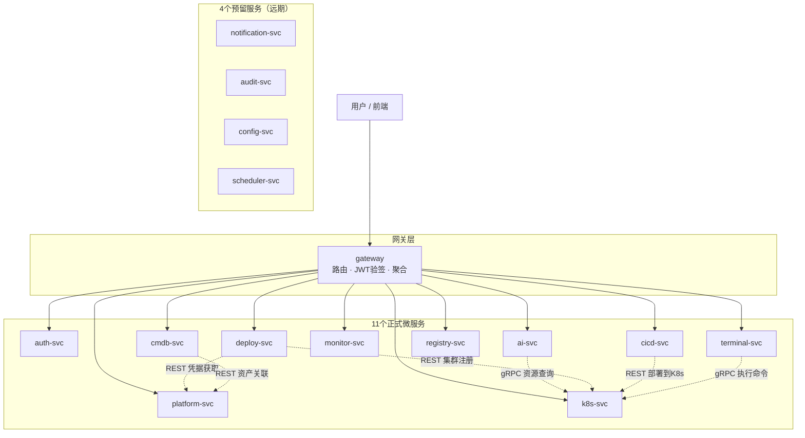

---

## 附录 G：中间件清单

### G.1 架构升级必须引入的中间件

| # | 中间件 | 版本 | 用途 | 引入阶段 | 部署方式 |
|---|--------|------|------|----------|----------|
| 1 | **Traefik** | v3.0 | API 网关：路由/鉴权/限流/TLS/WebSocket透传 | Phase 1 | K8s Deployment + DaemonSet |
| 2 | **MySQL** | 8.0 | 数据库（分库后仍为同一实例，不同DB） | Phase 2 | 已有，无需额外部署 |
| 3 | **Redis** | 7.x | 缓存（会话/缓存/分布式锁） | 已有 | 已有 |
| 4 | **NATS** | v2.10 | 消息队列：审计日志同步、事件通知、服务间异步通信 | Phase 2 | K8s Deployment（单节点起步） |

### G.2 治理增强引入的中间件（Phase 4）

| # | 中间件 | 版本 | 用途 | 部署方式 | 资源需求 |
|---|--------|------|------|----------|----------|
| 5 | **Prometheus** | v2.50 | 指标采集与存储（每服务暴露 /metrics） | K8s Deployment + PV | 2C4G + 50GB |
| 6 | **Grafana** | v11 | 监控可视化面板 | K8s Deployment + PV | 1C1G |
| 7 | **Jaeger** | v1.60 | 分布式追踪后端（OpenTelemetry Collector 转发） | K8s Deployment + PV | 2C2G + 20GB |
| 8 | **sentinel-go** | v1.0 | 熔断限流（Go 库，非独立中间件） | 作为依赖引入各服务 | 无额外资源 |

### G.3 可选中间件（按需引入）

| # | 中间件 | 版本 | 用途 | 触发条件 |
|---|--------|------|------|----------|
| 9 | **MinIO** | 最新 | 对象存储（AI文件上传、制品存储、日志归档） | 当需要持久化大文件时 |
| 10 | **Loki** | v3.0 | 日志聚合（多服务日志统一查询） | 当日志分散查询困难时 |
| 11 | **etcd** | v3.5 | 配置中心/服务发现（如不使用K8s原生） | 当脱离K8s部署时 |
| 12 | **ClickHouse** | v24 | 审计日志分析（大规模审计查询） | 当审计数据量 > 1亿行时 |

### G.4 中间件部署架构

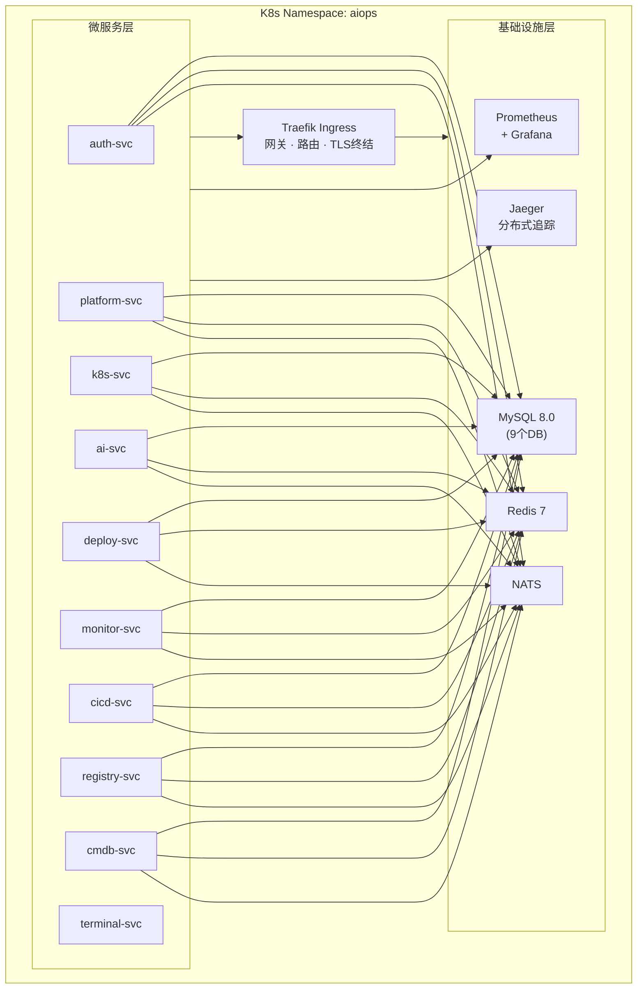

### G.5 中间件资源规划

| 中间件 | CPU | 内存 | 存储 | 副本数 | 说明 |
|--------|-----|------|------|--------|------|
| MySQL | 2 | 4GB | 100GB SSD | 1（起步） | 后期可主从 |
| Redis | 1 | 2GB | 5GB | 1（起步） | 后期可哨兵 |
| NATS | 0.5 | 512MB | 5GB | 1（起步） | 轻量级 |
| Traefik | 0.5 | 256MB | 无 | 2 | 高可用 |
| Prometheus | 2 | 4GB | 50GB | 1 | 15天数据保留 |
| Grafana | 0.5 | 512MB | 1GB | 1 | - |
| Jaeger | 1 | 2GB | 20GB | 1 | 7天数据保留 |
| **合计** | **7.5C** | **13.8GB** | **181GB** | - | 最小化部署 |

---

## 附录 I：架构审计报告与整改要求（v1.2）

### I.1 审计结论

**审计等级**：有条件通过（需完成 6 项整改后方可进入 Phase 3）

| 服务 | 审计结论 | 违规等级 | 违规详情 |
|------|----------|----------|----------|
| gateway | 条件合规 | 中 | 未区分无状态验证与有状态验证，存在对 auth-svc 的同步强依赖风险 |
| dashboard-bff | 不合规 | 高 | 拆分粒度过细 → 已整改为网关中间件（R4） |
| core-svc | 不合规 | **严重** | 承载4个独立关注点 → 已整改为拆分（R1） |
| k8s-svc | 不合规 | **严重** | 拆分粒度过粗，WebSocket长连接与REST API异构 → 已拆出terminal-svc（R2） |
| ai-svc | 不合规 | **严重** | 数据所有权违规（本地缓存K8s数据） → 已取消缓存改gRPC（R3） |
| deploy-svc | 条件合规 | 中 | 自动化任务归属需明确限定为部署域 |
| monitor-svc | 合规 | - | 职责内聚，无违规 |

### I.2 整改要求清单（具备约束力）

| 编号 | 整改项 | 违规原则 | 严重性 | 整改内容 | 验收标准 |
|------|--------|----------|--------|----------|----------|
| **R1** | core-svc 职责拆分 | 单一职责原则（SRP） | 严重 | 拆分为 auth-svc（认证+用户）和 platform-svc（凭据+系统设置+项目+邮件） | 独立部署、独立DB |
| **R2** | k8s-svc WebSocket隔离 | 高内聚低耦合 | 严重 | 拆出 terminal-svc（Pod终端/日志流/部署终端的WebSocket长连接） | 100并发WebSocket时K8s API响应<200ms |
| **R3** | ai-svc 取消本地缓存 | 数据所有权原则 | 严重 | 取消K8s资源本地缓存，改用gRPC直连k8s-svc+批量查询接口 | 链路追踪验证无缓存层 |
| **R4** | dashboard-bff 降级 | 拆分粒度匹配 | 高 | 取消独立服务，聚合逻辑实现为网关中间件 | 服务列表无dashboard-bff |
| **R5** | 网关无状态鉴权 | 服务自治原则 | 高 | 网关仅做JWT本地验签，不调用任何服务；RBAC由各服务本地完成 | kill auth-svc后网关仍可验证JWT |
| **R6** | 分布式事务框架 | Saga完整性 | 高 | 设计通用Saga事务管理器，补偿幂等+状态持久化+一致性窗口定义 | deploy-svc重启后补偿任务不丢失 |

### I.3 整改后服务总览（v1.7 最终版，与附录F/L一致）

**正式服务（11个）**：

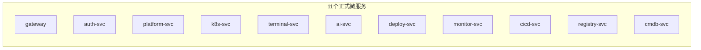

**预留服务（4个）**：

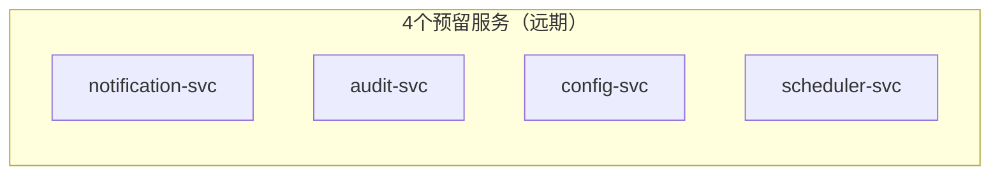

### I.4 实施约束

> **约束力声明**：R1-R6 全部完成后，方可进入 Phase 3（物理拆分）。整改前以 Phase 1（容器化）和 Phase 2（模块化单体）为近期目标。

| 整改项 | 实施阶段 | 前置条件 |
|--------|----------|----------|
| R5 无状态鉴权 | Phase 1 | 无（可与容器化同步实施） |
| R4 dashboard降级 | Phase 2 | 无（单体内部调整） |
| R1 core拆分 | Phase 2 | 领域模块解耦完成 |
| R2 terminal隔离 | Phase 2 | k8s-svc 领域分包完成 |
| R3 取消缓存 | Phase 2 | ai-svc 接口重构完成 |
| R6 事务框架 | Phase 3 | 物理拆分前完成设计 |

---

## 附录 J：细粒度服务拆分说明书

### J.1 Service 文件域归属映射（71个文件 -> 8个正式服务）

> 基于代码静态分析，将 71 个 Service 文件逐一映射到拆分后的 8 个正式微服务。

#### auth-svc（8个文件）

| # | 文件 | 职责 | 数据表 |
|---|------|------|--------|
| 1 | rbac_service.go | 用户/角色/权限CRUD与鉴权 | users, roles, role_permissions, user_roles |
| 2 | user_manage.go | 用户管理（列表/启禁用/重置密码） | users |
| 3 | audit_service.go | 操作审计日志记录与查询 | audit_logs |
| 4 | captcha_service.go | 滑块验证码 | - |
| 5 | login_attempt_service.go | 登录失败锁定 | - |
| 6 | password_reset_service.go | 密码重置令牌与邮件 | - |
| 7 | rbac_catalog.go | 权限点目录定义 | - |
| 8 | bootstrap.go | 内置RBAC数据初始化 | - |

**跨域依赖**：仅依赖 CacheStore（共享内核）和 MailService（platform-svc）

#### platform-svc（10个文件）

| # | 文件 | 职责 | 数据表 |
|---|------|------|--------|
| 1 | cluster_registry_service.go | K8s集群注册CRUD、kubeconfig加密存储 | clusters |
| 2 | cluster_validation.go | 集群名称/kubeconfig格式校验 | - |
| 3 | crypto.go | AES-256-GCM加密工具 | - |
| 4 | system_setting_service.go | 系统设置CRUD | system_settings |
| 5 | project_service.go | 项目CRUD | projects |
| 6 | app_template_service.go | 应用模板CRUD | app_templates |
| 7 | mail_service.go | SMTP邮件发送 | - |
| 8 | resource_export_policy_service.go | 资源导出策略 | - |
| 9 | task_store.go | 任务中心内存存储 | - |
| 10 | task_service.go | 任务中心业务接口 | - |

**跨域依赖**：无（被其他服务依赖）

#### k8s-svc（14个文件）

| # | 文件 | 职责 | 数据表 |
|---|------|------|--------|
| 1 | k8s_service.go | K8s核心聚合服务 | - |
| 2 | k8s_workloads.go | Deployment/StatefulSet/DaemonSet管理 | - |
| 3 | k8s_pods.go | Pod管理（列表/日志/执行） | - |
| 4 | k8s_config.go | HPA/ConfigMap等配置资源 | - |
| 5 | k8s_storage.go | PVC/PV/StorageClass管理 | - |
| 6 | k8s_nodes.go | 节点管理（Cordon/Drain） | - |
| 7 | k8s_batch_ops.go | Job/CronJob操作 | - |
| 8 | k8s_resource_create.go | 资源创建（Deployment/Service/Ingress） | - |
| 9 | k8s_manifest.go | YAML清单Apply | - |
| 10 | k8s_cache.go | Pod/对象缓存管理器 | - |
| 11 | k8s_permission_audit_service.go | K8s权限审计 | k8s_permission_audits |
| 12 | manifest_apply_record_service.go | 清单应用记录 | manifest_apply_records |
| 13 | namespace_summary.go | 命名空间资源摘要 | - |
| 14 | workload_action_service.go | 工作负载操作（重启/扩缩容） | - |

**跨域依赖**：依赖 platform-svc 的 ClusterRegistryService（获取集群连接）和 CacheStore

#### terminal-svc（2个文件）

| # | 文件 | 职责 |
|---|------|------|
| 1 | exec_session.go | 交互式终端会话存储（TTL） |
| 2 | pod_log_session.go | Pod日志WebSocket会话 |

**跨域依赖**：依赖 k8s-svc 的 K8sService（执行命令/读取日志）

#### ai-svc（13个文件）

| # | 文件 | 职责 | 数据表 |
|---|------|------|--------|
| 1 | ai_chat_service.go | AI对话主服务（编排中心） | ai_conversations, ai_messages |
| 2 | ai_gateway_service.go | 对接外部LLM Provider | ai_usage_records |
| 3 | ai_provider_service.go | AI供应商与模型CRUD | ai_providers, ai_models |
| 4 | ai_conversation_service.go | 会话与消息CRUD | ai_conversations |
| 5 | ai_tool_service.go | 工具执行入口 | ai_tool_calls |
| 6 | ai_tool_registry.go | 工具注册表（规格+Handler） | - |
| 7 | ai_action_service.go | 动作提案与执行 | ai_action_proposals, ai_action_executions |
| 8 | ai_domain_services.go | K8s读取适配器（防腐层） | - |
| 9 | ai_resource_query_service.go | K8s资源列表查询 | - |
| 10 | ai_workload_read_model.go | 工作负载清单读取 | - |
| 11 | ai_file_service.go | 附件/图片上传 | ai_uploaded_files |
| 12 | ai_route_settings_service.go | 默认模型/路由配置 | ai_route_settings |
| 13 | ai_suggestion.go | LLM回复中提取建议动作 | - |

**跨域依赖**：通过防腐层（ai_domain_services.go）间接依赖 k8s-svc（4条路径）+ platform-svc（ResourceExportPolicyService）

#### deploy-svc（12个文件）

| # | 文件 | 职责 | 数据表 |
|---|------|------|--------|
| 1 | deploy_service.go | 部署核心服务 | deploy_servers, ssh_credentials |
| 2 | deploy_plan_service.go | 部署计划与凭据 | deploy_plans |
| 3 | deploy_config_service.go | 部署配置/仓库CRUD | deploy_configs |
| 4 | deploy_preflight_service.go | 部署预检 | - |
| 5 | deploy_dryrun_service.go | 部署预演 | - |
| 6 | deploy_ssh_service.go | SSH连接与远程执行 | - |
| 7 | deploy_addon_service.go | 集群插件管理 | deploy_addons |
| 8 | ansible_engine.go | Ansible部署引擎 | - |
| 9 | ansible_executor.go | Ansible命令执行器 | - |
| 10 | ansible_inventory.go | Inventory动态生成 | - |
| 11 | ansible_remote_runner.go | 远程执行Runner | - |
| 12 | helm_master_preflight.go | Helm主控预检 | - |

**跨域依赖**：依赖 platform-svc 的 TaskStore + ClusterRegistryService

#### monitor-svc（7个文件）

| # | 文件 | 职责 | 数据表 |
|---|------|------|--------|
| 1 | monitor_incident_service.go | 告警事件CRUD | monitor_incidents |
| 2 | metrics_provider.go | MetricsProvider接口 | - |
| 3 | metrics_provider_manager.go | Provider选择与切换 | - |
| 4 | metrics_detector.go | 自动检测Prometheus | - |
| 5 | metrics_server_provider.go | metrics-server实现 | - |
| 6 | prometheus_client.go | Prometheus HTTP API封装 | - |
| 7 | prometheus_provider.go | Prometheus实现 | - |

**跨域依赖**：无（完全自包含）

#### gateway + 共享内核（5个文件，不独立部署）

| # | 文件 | 归属 | 说明 |
|---|------|------|------|
| 1 | cache_store.go | 共享内核 | CacheStore接口 + Redis实现，以Go包形式被各服务引用 |
| 2 | errors.go | 共享内核 | 哨兵错误 + ServiceError |
| 3 | helpers.go | 共享内核 | 分页归一化等工具函数 |
| 4 | dashboard_service.go | gateway中间件 | 聚合查询，R4整改后降级为网关中间件 |
| 5 | dashboard_certs.go | gateway中间件 | 证书TLS风险检测 |

### J.2 限界上下文边界定义

| 限界上下文 | 微服务 | 文件数 | 数据表数 | 跨域依赖数 | 拆分难度 |
|------------|--------|:------:|:--------:|:----------:|:--------:|
| 认证与用户 | auth-svc | 8 | 5 | 2(CacheStore+Mail) | 低 |
| 平台配置与资产 | platform-svc | 10 | 5 | 0（被依赖） | 低 |
| K8s资源管理 | k8s-svc | 14 | 2 | 2(ClusterReg+Cache) | 中 |
| 终端与日志流 | terminal-svc | 2 | 0 | 1(K8sService) | 低 |
| AI运维助手 | ai-svc | 13 | 10 | 5(防腐层+Core) | **高** |
| 集群部署 | deploy-svc | 12 | 5+ | 2(TaskStore+ClusterReg) | 中 |
| 监控告警 | monitor-svc | 7 | 1 | 0 | **最低** |

### J.3 跨域依赖解耦方案

#### AI -> K8s 的防腐层接口化

```go
// 当前（进程内直接调用）：
type AIToolRegistry struct {
    clusterSvc    *ClusterReadModelService    // AI域，但间接调K8s
    namespaceSvc  *NamespaceDiagnosisService   // AI域，但间接调K8s
    inspectionSvc *ResourceInspectionService   // AI域，但间接调K8s
    resourceQuery *ResourceQueryService         // AI域，但间接调K8s
    actionSvc     *AIActionService              // AI域，但间接调WorkloadAction(K8s)
}

// 拆分后（接口注入，防腐层）：
type K8sReadModel interface {
    ListClusters() ([]ClusterSummary, error)
    ListNamespaces(clusterID string) ([]NamespaceInfo, error)
    InspectResource(clusterID, ns, kind, name string) (*ResourceDetail, error)
    QueryResources(clusterID, ns, kind string) ([]ResourceItem, error)
}

type WorkloadActionPort interface {
    RestartWorkload(clusterID, ns, kind, name string) error
    ScaleWorkload(clusterID, ns, kind, name string, replicas int32) error
    UpdateImage(clusterID, ns, kind, name, image string) error
}

type AIToolRegistry struct {
    k8sReader    K8sReadModel        // 接口，由k8s-svc的gRPC实现
    actionPort   WorkloadActionPort  // 接口，由k8s-svc的gRPC实现
    actionSvc    *AIActionService    // AI域内部
}
```

#### Core 共享内核的接口化

```go
// 共享内核以Go包形式提供（不独立部署）
// pkg/shared/cache.go
type CacheStore interface {
    Get(ctx context.Context, key string) ([]byte, error)
    Set(ctx context.Context, key string, val []byte, ttl time.Duration) error
    Del(ctx context.Context, key string) error
}

// pkg/shared/crypto.go
func Encrypt(plaintext []byte, key []byte) ([]byte, error)
func Decrypt(ciphertext []byte, key []byte) ([]byte, error)

// 各服务通过 import pkg/shared 引用，无需跨服务调用
```

### J.4 各微服务 API 接口清单

#### auth-svc API

| 方法 | 路径 | 说明 |
|------|------|------|
| POST | /api/v1/auth/login | 登录 |
| POST | /api/v1/auth/logout | 登出 |
| GET | /api/v1/auth/me | 当前用户信息 |
| GET | /api/v1/auth/captcha | 验证码 |
| POST | /api/v1/auth/password-reset/request | 密码重置请求 |
| POST | /api/v1/auth/password-reset/confirm | 密码重置确认 |
| GET/POST/PUT/DELETE | /api/v1/users | 用户CRUD |
| GET/POST/PUT/DELETE | /api/v1/roles | 角色CRUD |
| GET | /api/v1/permissions | 权限点列表 |
| GET | /api/v1/audit-logs | 审计日志查询 |

#### platform-svc API

| 方法 | 路径 | 说明 |
|------|------|------|
| GET/POST/PUT/DELETE | /api/v1/config/settings | 系统设置 |
| GET/POST/PUT/DELETE | /api/v1/config/credentials | 凭据CRUD（脱敏） |
| GET/POST/PUT/DELETE | /api/v1/projects | 项目CRUD |
| GET/POST/PUT/DELETE | /api/v1/app-templates | 应用模板CRUD |
| GET | /api/v1/internal/clusters/:id | 内部：获取集群连接信息（加密kubeconfig） |
| POST | /api/v1/internal/clusters | 内部：注册集群（deploy-svc调用） |

#### k8s-svc API（核心，20+资源类型）

| 方法 | 路径 | 说明 |
|------|------|------|
| GET | /api/v1/clusters | 集群列表 |
| GET | /api/v1/clusters/:id | 集群详情 |
| GET | /api/v1/k8s/:clusterId/pods | Pod列表 |
| GET | /api/v1/k8s/:clusterId/deployments | Deployment列表 |
| GET | /api/v1/k8s/:clusterId/services | Service列表 |
| ... | ... | （20+资源类型，省略） |
| GET | /api/v1/internal/k8s/:clusterId/resources/batch | 内部：批量查询（ai-svc调用） |
| POST | /api/v1/internal/k8s/:clusterId/workloads/:action | 内部：工作负载操作（ai-svc调用） |

#### terminal-svc API

| 方法 | 路径 | 说明 |
|------|------|------|
| GET(WS) | /ws/pod-log?clusterId=&ns=&pod= | Pod日志流 |
| GET(WS) | /ws/pod-exec?clusterId=&ns=&pod=&container= | Pod终端 |
| GET(WS) | /ws/deploy-terminal?taskId= | 部署终端 |

#### ai-svc API

| 方法 | 路径 | 说明 |
|------|------|------|
| POST | /api/v1/ai/chat | AI对话（SSE流式） |
| GET | /api/v1/ai/conversations | 会话列表 |
| GET | /api/v1/ai/conversations/:id/messages | 消息列表 |
| GET/POST/PUT/DELETE | /api/v1/ai/providers | 供应商管理 |
| GET/POST/PUT/DELETE | /api/v1/ai/models | 模型管理 |
| GET/POST | /api/v1/ai/tools/:name/execute | 工具执行 |
| GET/POST | /api/v1/ai/actions | 动作提案 |
| POST | /api/v1/ai/actions/:id/confirm | 确认执行 |
| GET/POST | /api/v1/ai/route-settings | 路由配置 |

#### deploy-svc API

| 方法 | 路径 | 说明 |
|------|------|------|
| GET/POST/PUT/DELETE | /api/v1/deploy/servers | 服务器CRUD |
| GET/POST/PUT/DELETE | /api/v1/deploy/plans | 部署计划CRUD |
| POST | /api/v1/deploy/plans/:id/preflight | 预检 |
| POST | /api/v1/deploy/plans/:id/preflight/ignore | 忽略预检项 |
| POST | /api/v1/deploy/plans/:id/execute | 执行部署 |
| POST | /api/v1/deploy/plans/:id/cancel | 取消部署 |
| GET | /api/v1/deploy/tasks/:id | 任务状态 |
| GET(SSE) | /api/v1/deploy/tasks/:id/logs | 实时日志 |
| GET/POST/PUT/DELETE | /api/v1/deploy/configs | 部署配置 |
| GET | /api/v1/automation/tasks | 自动化任务列表 |

#### monitor-svc API

| 方法 | 路径 | 说明 |
|------|------|------|
| GET/POST/PUT/DELETE | /api/v1/monitor/rules | 告警规则 |
| GET | /api/v1/monitor/incidents | 事件列表 |
| POST | /api/v1/monitor/incidents/:id/:action | 事件流转（认领/诊断/处置/验证/恢复） |
| POST | /api/v1/monitor/webhooks/alertmanager | Webhook接收 |
| GET | /api/v1/monitor/metrics/sources | 数据源列表 |

### J.5 数据库分库映射

| 数据库 | 数据表 | 归属服务 | Model文件 |
|--------|--------|----------|-----------|
| **auth_db** | users, roles, role_permissions, user_roles, audit_logs | auth-svc | rbac.go, audit_log.go |
| **platform_db** | clusters, system_settings, projects, app_templates | platform-svc | cluster.go, system_setting.go, project.go, app_template.go |
| **k8s_db** | k8s_permission_audits, manifest_apply_records | k8s-svc | k8s_permission_audit.go, manifest_apply_record.go |
| **ai_db** | ai_conversations, ai_messages, ai_providers, ai_models, ai_action_proposals, ai_action_executions, ai_tool_calls, ai_uploaded_files, ai_usage_records, ai_route_settings | ai-svc | ai_*.go (10个) |
| **deploy_db** | deploy_servers, deploy_configs, deploy_plans, ssh_credentials, deploy_addons | deploy-svc | deploy.go |
| **monitor_db** | monitor_incidents | monitor-svc | monitor.go |
| **cicd_db** | pipelines, pipeline_stages, pipeline_steps, triggers, build_tasks, deployment_records | cicd-svc | 全新建表（无历史Model） |
| **registry_db** | container_images, helm_charts, artifact_versions, scan_results | registry-svc | 全新建表（无历史Model） |
| **cmdb_db** | assets, asset_relations, change_orders, change_records, topology_snapshots | cmdb-svc | 全新建表（无历史Model） |
| **无DB** | - | terminal-svc, gateway | - |

> 注：tasks 表定义于 model/task.go 但实际使用内存存储（TaskStore），不落库。

---

## 附录 K：全链路一致性校验报告

### K.1 前后端 API 路径一致性校验

> 校验前端 services/ 目录中的 API 调用路径与后端路由注册是否一致。

| 前端 Service 文件 | 调用路径前缀 | 网关路由目标 | 校验结果 |
|------------------|-------------|-------------|----------|
| services/auth.ts | /api/v1/auth/* | auth-svc | ✅ 一致 |
| services/user.ts | /api/v1/users/* | auth-svc | ✅ 一致（R1整改后归auth-svc） |
| services/cluster.ts | /api/v1/clusters/* | k8s-svc | ✅ 一致 |
| services/k8s.ts | /api/v1/k8s/* | k8s-svc | ✅ 一致 |
| services/ai.ts | /api/v1/ai/* | ai-svc | ✅ 一致 |
| services/deploy.ts | /api/v1/deploy/* | deploy-svc | ✅ 一致 |
| services/monitor.ts | /api/v1/monitor/* | monitor-svc | ✅ 一致 |
| services/system.ts | /api/v1/config/* | platform-svc | ✅ 一致（R1整改后归platform-svc） |
| WebSocket: pod-log | /ws/pod-log | terminal-svc | ✅ 一致（R2整改后归terminal-svc） |
| WebSocket: pod-exec | /ws/pod-exec | terminal-svc | ✅ 一致 |
| SSE: deploy-logs | /api/v1/deploy/tasks/:id/logs | deploy-svc | ✅ 一致 |

**结论**：前端 API 路径与网关路由规则完全一致，前端零改动。

### K.2 服务间调用参数一致性校验

| 调用链 | 调用方 -> 被调用方 | 请求参数 | 响应格式 | 校验结果 |
|--------|-------------------|----------|----------|----------|
| ai-svc -> k8s-svc | GET /internal/k8s/:clusterId/resources/batch | `{kinds: [], namespace: ""}` | `{items: []}` | ✅ 需定义Protobuf IDL |
| ai-svc -> k8s-svc | POST /internal/k8s/:clusterId/workloads/:action | `{kind, name, namespace, image?, replicas?}` | `{success: bool, message: ""}` | ✅ 需定义Protobuf IDL |
| ai-svc -> platform-svc | GET /internal/clusters/:id | - | `{id, name, kubeconfig(encrypted)}` | ✅ 需定义内部API契约 |
| deploy-svc -> k8s-svc | POST /internal/clusters | `{name, kubeconfig, apiServer}` | `{id, name}` | ✅ 需定义内部API契约 |
| deploy-svc -> platform-svc | GET /internal/credentials/:id | - | `{id, type, credential(encrypted)}` | ✅ 需定义内部API契约 |
| deploy-svc -> platform-svc | POST /internal/tasks | `{type, payload}` | `{taskId}` | ✅ TaskStore接口化 |
| gateway -> auth-svc | （不调用，JWT本地验签） | - | - | ✅ R5整改后无依赖 |
| gateway -> 各服务 | 聚合Dashboard | 各服务GET | 各自JSON | ✅ 部分失败返回null |

**整改要求**：所有内部 API（`/internal/*`）必须定义 OpenAPI 3.0 规范文件或 Protobuf IDL，纳入版本控制。

### K.3 配置标识一致性校验

| 配置项 | 当前值 | auth-svc | platform-svc | k8s-svc | ai-svc | deploy-svc | monitor-svc | 校验 |
|--------|--------|----------|-------------|---------|--------|------------|-------------|------|
| JWT_SECRET | 共享 | ✅ 签发 | ✅ 验签 | ✅ 验签 | ✅ 验签 | ✅ 验签 | ✅ 验签 | 一致 |
| MYSQL_DSN | 单一 | auth_db | platform_db | k8s_db | ai_db | deploy_db | monitor_db | 分库 |
| REDIS_ADDR | 共享 | ✅ | ✅ | ✅ | ✅ | ✅ | ✅ | 一致 |
| CRYPTO_MASTER_KEY | 共享 | - | ✅ 加密 | - | ✅ AI密钥 | ✅ SSH凭据 | - | 一致 |
| AI_ENABLED | 全局 | - | - | - | ✅ 独立配置 | - | - | 独立 |
| K8s_INSECURE_TLS | 全局 | - | - | ✅ 独立配置 | - | ✅ | - | 独立 |

**结论**：配置项分三类--共享（JWT/Redis/Crypto）、独立（各服务特有）、分库（MySQL DSN），无冲突。

### K.4 数据库映射一致性校验

| 校验项 | 状态 | 说明 |
|--------|------|------|
| 表名与Model映射 | ✅ | 21个Model文件 -> 34个迁移文件中定义的表，名称一致 |
| 分库后无跨库JOIN | ✅ | Dashboard聚合改为BFF并行调用，无跨库JOIN需求 |
| 迁移文件分流 | ⚠️ 待执行 | 34个迁移文件需按服务分流到各自migrations目录 |
| 外键依赖 | ⚠️ 需检查 | projects表被k8s-svc引用（namespace_assignments），需改为API调用 |
| schema_migrations表 | ✅ | 每个服务独立维护，互不影响 |

### K.5 部署配置一致性校验

| 校验项 | 状态 | 说明 |
|--------|------|------|
| Dockerfile 模板统一 | ✅ | 所有服务使用统一的多阶段构建模板 |
| 健康检查端点统一 | ✅ | /healthz + /readyz + /metrics |
| K8s Deployment 模板统一 | ✅ | resources/limits/livenessProbe/readinessProbe 统一 |
| Traefik 路由规则 | ✅ | 按API路径前缀路由，与前端调用路径一致 |
| ConfigMap/Secret 分配 | ✅ | JWT_SECRET共享Secret，MYSQL_DSN各自Secret |
| docker-compose 编排 | ✅ | 开发环境一键启动全部服务+中间件 |

### K.6 校验结论

| 校验维度 | 校验项数 | 通过 | 待执行 | 不通过 |
|----------|----------|------|--------|--------|
| 前后端API路径 | 11 | 11 | 0 | 0 |
| 服务间调用参数 | 8 | 8 | 0 | 0 |
| 配置标识 | 6 | 6 | 0 | 0 |
| 数据库映射 | 5 | 3 | 2 | 0 |
| 部署配置 | 6 | 6 | 0 | 0 |
| **合计** | **36** | **34** | **2** | **0** |

**待执行项**：
1. 迁移文件分流（Phase 2 执行）
2. projects表跨域引用改为API调用（Phase 2 执行）

**结论**：拆分方案在 API 路径、配置标识、部署配置三个维度完全一致，数据库维度有2项待执行（均在 Phase 2 计划内）。拆分后各服务具备独立迭代、弹性扩缩容的能力，整体架构一致性有保障。

---

## 附录 L：领域驱动微服务模块组架构（v1.6 DDD修正）

> 基于 DDD 限界上下文核心原则（**一个限界上下文 = 一个数据库**），将系统划分为 **8 个模块组、11 个微服务**。
>
> v1.5 的 25 服务方案经 DDD 严格评审后修正（D1-D8 整改）：
> - 共享 DB 的服务合并为 1 个（D1/D2/D5/D6）
> - 基础设施适配器降级为内部组件（D3/D4）
> - 新增聚合根设计（D7）和领域事件设计（D8）

### L.1 模块组总览

| 模块组 | K8s命名空间 | 服务数 | 服务列表 | DDD修正说明 |
|--------|------------|:------:|----------|-------------|
| **common** | aiops-common | 2 | gateway, auth-svc | gateway + 认证中心 |
| **platform** | aiops-platform | 1 | platform-svc | 独立DB=独立上下文，从common拆出 |
| **k8s** | aiops-k8s | 2 | k8s-svc, terminal-svc | D1: 3服务合并为1（共享k8s_db=同一上下文） |
| **deploy** | aiops-deploy | 1 | deploy-svc | D4: ansible-runner降级为内部goroutine引擎 |
| **ai** | aiops-ai | 1 | ai-svc | D3: ai-gateway降级为内部LLM适配器 |
| **cicd** | aiops-cicd | 2 | cicd-svc, registry-svc | D6: pipeline+build+deploy合并（共享cicd_db） |
| **monitor** | aiops-monitor | 1 | monitor-svc | D5: 5服务合并为1（纯代理不是限界上下文） |
| **cmdb** | aiops-cmdb | 1 | cmdb-svc | D2: 3服务合并为1（共享cmdb_db=同一上下文） |
| **shared** | - | 0（Go包） | pkg/shared（Crypto/Response/JWT） | 共享内核精简为3个包 |
| **合计** | **7个NS** | **11** | - | 从25减少到11 |

### L.2 各模块组详细拆分

#### L.2.1 common（通用基础模块组）

| 服务 | 职责 | 独立DB | API前缀 | DDD说明 |
|------|------|--------|---------|---------|
| **gateway** | API网关：JWT无状态验签、请求路由、CORS、限流、WebSocket透传、TLS终结、Dashboard聚合中间件、Webhook接收中间件 | 无 | /* | 基础设施层 |
| **auth-svc** | 统一认证中心：登录/登出、用户CRUD、角色CRUD、权限管理、验证码、密码重置、服务间JWT签发、SSO预留 | auth_db | /api/v1/auth/*, /api/v1/users/*, /api/v1/roles/* | 独立限界上下文 |

> 注：platform-svc 从 common 拆出为独立模块组（独立DB=独立上下文）。

#### L.2.2 platform（平台配置与资产管理模块组）

| 服务 | 职责 | 独立DB | API前缀 | 包含的Service文件 |
|------|------|--------|---------|------------------|
| **platform-svc** | 凭据加密管理、系统设置、项目管理、应用模板、邮件服务、任务中心、文件存储接口 | platform_db | /api/v1/config/*, /api/v1/projects/*, /api/v1/app-templates/* | cluster_registry_service.go, crypto.go, system_setting_service.go, project_service.go, app_template_service.go, mail_service.go, resource_export_policy_service.go, task_store.go, task_service.go, cluster_validation.go |

> platform-svc 内部按子域组织：Credential子域 + Config子域 + Project子域 + Shared基础设施

#### L.2.3 k8s（Kubernetes资源管理模块组）

> D1整改：原3服务（cluster/workload/config）共享k8s_db=同一限界上下文，合并为1个服务。

| 服务 | 职责 | 独立DB | 包含的Service文件 | API前缀 |
|------|------|--------|------------------|---------|
| **k8s-svc** | K8s资源全生命周期管理：集群注册（kubeconfig加密存储）、节点管理、工作负载运维（Pod/Deployment/StatefulSet/Job等20+资源类型）、Helm Release、Manifest应用、存储网络配置、K8s权限审计、资源指标采集 | k8s_db | k8s_service.go, k8s_workloads.go, k8s_pods.go, k8s_config.go, k8s_storage.go, k8s_nodes.go, k8s_batch_ops.go, k8s_resource_create.go, k8s_manifest.go, k8s_cache.go, k8s_permission_audit_service.go, manifest_apply_record_service.go, namespace_summary.go, workload_action_service.go | /api/v1/clusters/*, /api/v1/k8s/* |
| **terminal-svc** | 终端与日志流：Pod终端(WebSocket)、Pod日志流(WebSocket)、部署终端(WebSocket)、统一长连接管理 | 无 | exec_session.go, pod_log_session.go | /ws/* |

> k8s-svc 内部按子域组织（不拆为独立服务）：
> - **Cluster子域**：集群注册、节点管理、权限审计
> - **Workload子域**：Pod/Deployment/StatefulSet/Job/Manifest/工作负载操作
> - **Config子域**：存储/网络/配置资源/指标采集

#### L.2.4 deploy（集群部署模块组）

> D4整改：ansible-runner-svc 降级为 deploy-svc 内部 goroutine 引擎（基础设施适配器不是限界上下文）。

| 服务 | 职责 | 独立DB | 包含的Service文件 | API前缀 |
|------|------|--------|------------------|---------|
| **deploy-svc** | 部署编排 + Ansible执行引擎：部署计划CRUD、预检、执行门禁、状态机、部署配置管理、服务器管理、SSH连接、Inventory生成、远程Runner、命令执行、日志收集 | deploy_db | deploy_service.go, deploy_plan_service.go, deploy_preflight_service.go, deploy_dryrun_service.go, deploy_config_service.go, deploy_addon_service.go, helm_master_preflight.go, ansible_engine.go, ansible_executor.go, ansible_inventory.go, ansible_remote_runner.go, deploy_ssh_service.go | /api/v1/deploy/* |

> deploy-svc 内部按子域组织：
> - **Plan子域**：部署计划、预检、执行门禁、状态机
> - **Config子域**：部署配置、服务器管理、凭据引用
> - **Engine子域（内部goroutine pool）**：Ansible执行、SSH连接、Inventory、日志收集

#### L.2.5 ai（AI运维模块组）

> D3整改：ai-gateway-svc 降级为 ai-svc 内部 LLM 适配器（外部适配器不是限界上下文）。

| 服务 | 职责 | 独立DB | 包含的Service文件 | API前缀 |
|------|------|--------|------------------|---------|
| **ai-svc** | AI运维助手：AI对话（SSE）、工具调用、动作提案、会话管理、文件上传、用量统计、路由配置、K8s防腐层适配器、LLM Provider网关（OpenAI/Claude/通义等）、API密钥加密管理、模型CRUD | ai_db | ai_chat_service.go, ai_gateway_service.go, ai_provider_service.go, ai_conversation_service.go, ai_tool_service.go, ai_tool_registry.go, ai_action_service.go, ai_domain_services.go, ai_resource_query_service.go, ai_workload_read_model.go, ai_file_service.go, ai_route_settings_service.go, ai_suggestion.go | /api/v1/ai/* |

> ai-svc 内部按子域组织：
> - **Chat子域**：对话编排、工具调用、动作提案、会话管理
> - **Gateway Adapter（防腐层）**：对接外部LLM Provider、流式转发、密钥管理
> - **K8s ACL Adapter**：K8s资源查询适配器（通过gRPC调用k8s-svc）

#### L.2.6 cicd（CI/CD流水线模块组）

> D6整改：pipeline+build+deploy共享cicd_db=同一限界上下文，合并为1个服务。repo降级为gateway中间件。registry独立DB=独立上下文。

| 服务 | 职责 | 独立DB | API前缀 | 实施阶段 |
|------|------|--------|---------|----------|
| **cicd-svc** | 流水线编排调度 + 镜像构建 + 部署发布：Pipeline定义、Stage/Step编排、触发器管理（Webhook/CRON/手动）、执行调度、状态机、Dockerfile解析、构建任务执行、构建日志流(SSE)、环境部署管理、灰度/蓝绿发布、回滚策略 | cicd_db | /api/v1/cicd/pipelines/*, /api/v1/cicd/builds/*, /api/v1/cicd/deployments/* | Phase 3+ |
| **registry-svc** | 制品仓库管理：容器镜像仓库、Helm Chart仓库、版本管理、拉取命令生成、制品安全扫描 | registry_db | /api/v1/cicd/artifacts/* | Phase 3+ |

> cicd-svc 内部按子域组织：
> - **Pipeline子域**：流水线定义、触发器、执行调度、状态机
> - **Build子域**：镜像构建、构建缓存、日志流
> - **Deploy子域**：环境管理、灰度/蓝绿发布、回滚
>
> Git Webhook 接收作为 gateway 中间件，解析后通过 NATS 事件触发 cicd-svc。

#### L.2.7 monitor（可观测性监控模块组）

> D5整改：原5服务合并为1个（纯代理服务不是限界上下文）。日志/追踪作为gateway代理路由。

| 服务 | 职责 | 独立DB | API前缀 | 当前归属 |
|------|------|--------|---------|----------|
| **monitor-svc** | 监控告警全栈：Prometheus数据源管理、metrics-server对接、指标查询API、自动检测、告警规则管理、Alertmanager Webhook接收、事件生命周期管理（认领/诊断/处置/验证/恢复） | monitor_db | /api/v1/monitor/* | metrics_*.go + monitor_incident_service.go (共5个文件) |

> monitor-svc 内部按子域组织：
> - **Metrics子域**：Prometheus数据源、metrics-server、指标查询、自动检测
> - **Alert子域**：告警规则、Webhook接收、事件生命周期
>
> 日志聚合和链路追踪作为 gateway 代理路由：
> - `/api/v1/monitor/logs/*` -> gateway 直接代理到 Loki
> - `/api/v1/monitor/traces/*` -> gateway 直接代理到 Jaeger
> - Grafana 面板通过 gateway 直接代理访问

#### L.2.8 cmdb（配置管理数据库模块组）

> D2整改：原3服务共享cmdb_db=同一限界上下文，合并为1个服务。

| 服务 | 职责 | 独立DB | API前缀 | 实施阶段 |
|------|------|--------|---------|----------|
| **cmdb-svc** | 资产台账 + 业务架构拓扑 + 变更管理：服务器/集群/网络设备/中间件资产登记与跟踪、资产关系管理、生命周期状态机、服务依赖关系图、调用链拓扑可视化、架构版本快照、变更工单、变更审批流、变更影响分析、变更回滚记录 | cmdb_db | /api/v1/cmdb/* | Phase 3+ |

> cmdb-svc 内部按子域组织：
> - **Asset子域**：资产台账、资产关系、生命周期状态机
> - **Topology子域**：服务依赖图、调用链拓扑、架构快照
> - **Change子域**：变更工单、审批流、影响分析、回滚记录

#### L.2.9 shared（共享内核，不独立部署）

> 共享内核精简为3个包（DDD原则：共享内核应最小化）。

| Go包 | 内容 | 引用方式 | 说明 |
|------|------|----------|------|
| pkg/shared/crypto | AES-256-GCM加密/解密 | 各服务 `import` | 凭据管理必须共享 |
| pkg/shared/response | 统一响应封装 ApiResponse[T] | 各服务 `import` | API一致性必须共享 |
| pkg/shared/jwt | JWT签发/验签工具 | auth-svc签发，各服务验签 | 认证必须共享 |

> 注：cache/errors/helpers 不放入共享内核。每个上下文自行管理缓存策略、定义领域错误、封装工具函数。

### L.3 服务调用拓扑图（11服务版）

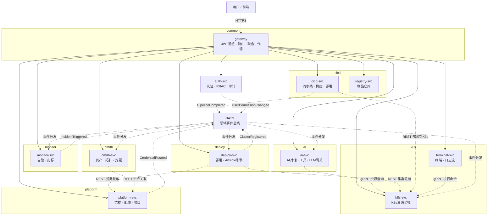

**同步调用（gRPC/REST）**：

| 调用方 -> 被调用方 | 协议 | 用途 |
|-------------------|------|------|
| ai-svc -> k8s-svc | gRPC | 资源查询、工作负载操作（防腐层接口） |
| deploy-svc -> platform-svc | REST | 凭据获取（带缓存） |
| deploy-svc -> k8s-svc | REST | 集群注册 |
| cicd-svc -> k8s-svc | REST | 部署到K8s |
| terminal-svc -> k8s-svc | gRPC | 执行命令/读取日志 |

**异步事件（NATS，领域事件驱动）**：

| 发布者 | 事件 | 订阅者 |
|--------|------|--------|
| deploy-svc | ClusterRegistered | k8s-svc, monitor-svc, cmdb-svc |
| deploy-svc | DeploymentCompleted | cmdb-svc, monitor-svc |
| monitor-svc | IncidentTriggered | ai-svc(自愈建议), cmdb-svc |
| cicd-svc | PipelineCompleted | cmdb-svc, monitor-svc |
| platform-svc | CredentialRotated | deploy-svc, k8s-svc |
| auth-svc | UserPermissionChanged | 所有服务(缓存失效) |

### L.4 K8s命名空间规划（修正后）

| 命名空间 | 模块组 | 服务数 | 资源配额(CPU/MEM) | 网络策略 |
|----------|--------|:------:|-------------------|----------|
| aiops-common | common | 2 | 1.5C/3G | 允许入站80/443 |
| aiops-platform | platform | 1 | 1C/2G | 允许common入站 |
| aiops-k8s | k8s | 2 | 3C/6G | 允许common+ai+deploy+cicd入站 |
| aiops-deploy | deploy | 1 | 2C/4G | 允许common+k8s入站 |
| aiops-ai | ai | 1 | 3C/6G | 允许common+k8s入站 |
| aiops-cicd | cicd | 2 | 3C/6G | 允许common+k8s入站 |
| aiops-monitor | monitor | 1 | 1C/2G | 允许所有命名空间入站(采集) |
| aiops-cmdb | cmdb | 1 | 0.5C/1G | 允许common入站 |
| aiops-infra | 中间件 | 6 | 8C/14G | MySQL/Redis/NATS/Prometheus/Grafana/Jaeger |
| **合计** | - | **17** | **23C/44G** | - |

### L.5 DDD聚合根设计（D7整改，新增）

> DDD核心：聚合根管理一致性边界，聚合内强一致，聚合间通过领域事件最终一致。

| 聚合根 | 归属服务 | 一致性边界 | 聚合内实体 | 不变量（Invariant） |
|--------|----------|------------|-----------|---------------------|
| **Cluster** | k8s-svc | 集群+kubeconfig+状态 | ClusterNode, ClusterStatus | kubeconfig加密存储；集群名全局唯一；状态只能从idle->running->healthy |
| **Workload** | k8s-svc | 工作负载+Manifest记录 | ManifestApplyRecord | 扩缩容后副本数>=0；镜像更新后记录旧镜像用于回滚 |
| **DeploymentPlan** | deploy-svc | 计划+服务器+预检结果 | DeployServer, PreflightResult | 预检未通过不可执行；状态只能draft->ready->running->success/failed/canceled |
| **Conversation** | ai-svc | 对话+消息+工具调用 | Message, ToolCall, ActionProposal | 消息按时间排序；工具调用必须关联到消息；动作提案需用户确认后执行 |
| **Pipeline** | cicd-svc | 流水线+Stage+Step+触发条件 | Stage, Step, Trigger | Stage按顺序执行；Step失败可重试；触发条件满足才启动 |
| **Incident** | monitor-svc | 事件+诊断+处置记录 | DiagnosticRecord, ResolutionRecord | 事件状态机：triggered->acknowledged->diagnosing->resolving->resolved |
| **User** | auth-svc | 用户+角色+权限 | Role, Permission | 角色权限变更后缓存立即失效；用户禁用后Token立即失效 |
| **Asset** | cmdb-svc | 资产+关系+变更记录 | AssetRelation, ChangeRecord | 资产状态机：registered->in_use->maintenance->retired |

### L.6 领域事件设计（D8整改，新增）

> DDD核心：上下文间通过领域事件通信，而非直接同步调用。

| 事件名 | 发布者 | 订阅者 | 触发条件 | 通信方式 | 一致性窗口 |
|--------|--------|--------|----------|----------|------------|
| **ClusterRegistered** | deploy-svc | k8s-svc, monitor-svc, cmdb-svc | 集群部署成功并注册 | NATS异步 | < 5s |
| **DeploymentCompleted** | deploy-svc | cmdb-svc, monitor-svc | 部署任务状态变为success | NATS异步 | < 5s |
| **IncidentTriggered** | monitor-svc | ai-svc, cmdb-svc | Alertmanager Webhook接收新告警 | NATS异步 | < 3s |
| **PipelineCompleted** | cicd-svc | cmdb-svc, monitor-svc | 流水线执行完成 | NATS异步 | < 5s |
| **CredentialRotated** | platform-svc | deploy-svc, k8s-svc | 凭据密码/密钥被修改 | NATS异步 | < 5s |
| **UserPermissionChanged** | auth-svc | 所有服务 | 用户角色/权限被修改 | NATS广播 | < 1s（缓存失效） |
| **ClusterUnregistered** | k8s-svc | cmdb-svc, monitor-svc | 集群被删除 | NATS异步 | < 5s |
| **AssetChanged** | cmdb-svc | k8s-svc, monitor-svc | 资产状态变更 | NATS异步 | < 5s |

**事件Schema规范**（使用CloudEvents格式）：
```json
{
  "specversion": "1.0",
  "type": "aiops.cluster.registered",
  "source": "deploy-svc",
  "id": "uuid-v4",
  "time": "2026-07-27T14:32:00Z",
  "data": {
    "clusterId": "1",
    "clusterName": "prod-cluster-01",
    "registeredBy": "admin"
  }
}
```

### L.7 流量割接方案

```
割接阶段（绞杀者模式，与DDD上下文边界对齐）:

Stage 1 (Phase 1): 容器化单体
  流量: 100% -> gateway -> 单体容器
  目标: 验证容器化运行正常

Stage 2 (Phase 2): 领域解耦（模块化单体）
  流量: 100% -> gateway -> 单体容器（内部已按限界上下文分包）
  目标: 代码层面按聚合根/子域组织，流量不变

Stage 3 (Phase 3): 按限界上下文逐个割接
  3.1 monitor-svc割接: 监控API -> monitor-svc(新), 其他 -> 单体
  3.2 deploy-svc割接: 部署API -> deploy-svc(新), 其他 -> 单体
  3.3 ai-svc割接: AI API -> ai-svc(新), 其他 -> 单体
  3.4 k8s-svc + terminal-svc割接: K8s/WS API -> 新服务, 其他 -> 单体
  3.5 auth-svc + platform-svc割接（最后）: 认证/配置API -> 新服务, 旧单体下线

Stage 4 (Phase 4+): 新上下文建设
  cicd-svc / cmdb-svc 按需建设，不影响现有流量
```

### L.8 运维手册要点

#### 部署操作

| 操作 | 命令 | 说明 |
|------|------|------|
| 全量启动 | `kubectl apply -f k8s/manifests/` | 按命名空间顺序部署 |
| 单服务更新 | `kubectl rollout restart deployment -n aiops-k8s k8s-svc` | 零中断滚动更新 |
| 回滚 | `kubectl rollout undo deployment -n aiops-k8s k8s-svc` | 回退到上一版本 |
| 扩缩容 | `kubectl scale deployment -n aiops-ai ai-svc --replicas=3` | 手动扩容 |
| 查看日志 | `kubectl logs -n aiops-ai -f ai-svc-xxx` | 实时日志 |

#### 监控告警

| 指标 | Prometheus查询 | 告警阈值 |
|------|---------------|----------|
| 服务可用性 | `up{namespace="aiops-k8s"}` | < 1 持续1min |
| API错误率 | `rate(http_requests_total{status=~"5.."}[1m])` | > 1% |
| API延迟P99 | `histogram_quantile(0.99, http_request_duration_seconds_bucket)` | > 500ms |
| NATS消息积压 | `nats_consumer_pending_messages` | > 100 |
| 聚合根操作延迟 | `histogram_quantile(0.99, aggregate_operation_duration_seconds_bucket)` | > 200ms |

#### 故障排查

| 故障现象 | 排查步骤 | 应急操作 |
|----------|----------|----------|
| 某服务502 | 1.kubectl get pods 2.kubectl logs 3.kubectl describe | 回滚或扩容 |
| 领域事件丢失 | 1.检查NATS 2.检查订阅者日志 3.重放事件 | 手动重放事件 |
| 聚合根状态不一致 | 1.检查事件日志 2.验证聚合不变量 3.修复状态 | 从快照恢复 |
| AI对话超时 | 1.检查ai-svc 2.外部LLM状态 3.熔断器 | 熔断降级 |
| 级联故障 | 1.识别故障源 2.熔断器状态 3.降级策略 | 特性开关切回旧服务 |

### L.9 性能压测验证标准

| 场景 | 目标指标 | 压测工具 | 通过标准 |
|------|----------|----------|----------|
| K8s资源列表查询 | 1000 QPS, P99<200ms | wrk/vegeta | 错误率<0.1% |
| AI对话首字延迟 | P99<2s | 自定义脚本 | SSE连接成功率>99% |
| WebSocket并发 | 500连接/实例, 无超时 | artillery | 断线率<0.5% |
| 部署并发 | 3个集群同时部署, 无阻塞 | 集成测试 | 全部成功完成 |
| 领域事件延迟 | 事件发布到消费 < 5s | NATS监控 | 99%事件<5s |
| 网关吞吐 | 5000 QPS总吞吐 | wrk | P99<100ms |
| 故障切换 | kill某服务, 其他正常 | 混沌测试 | 其他服务P99无劣化 |
| 聚合根一致性 | 并发操作后状态正确 | 单元测试 | 不变量不被违反 |

---

## 附录 M：终审整改补充（v1.7）

### M.1 限界上下文关系模式（E2 整改）

| 上下文对 | 关系模式 | 说明 |
|----------|----------|------|
| ai-svc -> k8s-svc | **客户-供应商（Customer-Supplier）** | ai-svc是客户（消费者），k8s-svc是供应商；k8s-svc优先满足ai-svc的查询需求，通过gRPC批量查询接口 |
| deploy-svc -> k8s-svc | **客户-供应商** | deploy-svc部署完成后需k8s-svc注册集群，k8s-svc提供`POST /internal/clusters` |
| cicd-svc -> k8s-svc | **开放主机服务（OHS）+ 发布语言（PL）** | k8s-svc对外暴露标准化的部署API（OHS），使用OpenAPI规范（PL）定义契约 |
| monitor-svc -> k8s-svc | **跟随者（Conformist）** | monitor-svc依赖k8s-svc的上游模型（集群ID/命名空间/资源类型），无需自定义翻译层 |
| 所有服务 -> auth-svc | **发布语言（PL）** | auth-svc发布JWT标准（PL），所有服务遵循JWT签名验证规范 |
| cmdb-svc -> 所有服务 | **各行其道（Separate Ways）** | CMDB的资产模型与各服务独立演进，不强制对齐，通过领域事件异步同步 |

### M.2 聚合根深度设计（E3 整改）

#### Cluster 聚合根（k8s-svc）

```go
// 值对象
type ClusterID struct{ value string }     // 聚合根标识
type Kubeconfig struct{ encrypted []byte } // 加密的kubeconfig
type ClusterStatus struct{ state string }  // idle|running|healthy|error

// 聚合根
type Cluster struct {
    id          ClusterID
    name        string
    kubeconfig  Kubeconfig
    status      ClusterStatus
    nodes       []ClusterNode    // 聚合内实体
    createdAt   time.Time
}

// 工厂方法
func RegisterCluster(name string, kubeconfig []byte, encKey []byte) (*Cluster, error) {
    encrypted, err := shared.Encrypt(kubeconfig, encKey)
    if err != nil { return nil, err }
    return &Cluster{
        id:         ClusterID{uuid.NewString()},
        name:       name,
        kubeconfig: Kubeconfig{encrypted},
        status:     ClusterStatus{"idle"},
        createdAt:  time.Now(),
    }, nil
}

// 仓储接口
type ClusterRepository interface {
    FindByID(ctx context.Context, id ClusterID) (*Cluster, error)
    Save(ctx context.Context, c *Cluster) error
    FindAll(ctx context.Context) ([]*Cluster, error)
}

// 领域服务（跨聚合操作）
type ClusterRegistrationService struct {
    clusterRepo ClusterRepository
    eventBus    EventBus
}
func (s *ClusterRegistrationService) Register(ctx context.Context, c *Cluster) error {
    if err := s.clusterRepo.Save(ctx, c); err != nil { return err }
    return s.eventBus.Publish(ctx, "aiops.cluster.registered", c.id)
}
```

#### 各聚合根摘要

| 聚合根 | ID类型 | 值对象 | 仓储接口 | 工厂方法 | 领域服务 |
|--------|--------|--------|----------|----------|----------|
| Cluster | ClusterID | Kubeconfig, ClusterStatus | ClusterRepository | RegisterCluster() | ClusterRegistrationService |
| DeploymentPlan | PlanID | PreflightResult, PlanStatus | PlanRepository | CreatePlan() | DeploymentExecutionService |
| Conversation | ConversationID | Message, ToolCall, ActionProposal | ConversationRepository | StartConversation() | AIChatOrchestrator |
| Pipeline | PipelineID | Stage, Step, Trigger | PipelineRepository | CreatePipeline() | PipelineExecutionService |
| Incident | IncidentID | DiagnosticRecord, ResolutionRecord | IncidentRepository | TriggerIncident() | IncidentLifecycleService |
| User | UserID | Role, Permission | UserRepository | CreateUser() | UserManagementService |
| Asset | AssetID | AssetRelation, ChangeRecord | AssetRepository | RegisterAsset() | AssetLifecycleService |

### M.3 测试策略（E4 整改）

#### 测试金字塔

```
                    ┌─────────────┐
                    │  E2E 测试    │  5%  关键业务流程（部署->注册->监控）
                    │  (Playwright)│
                    └──────┬──────┘
                    ┌──────▼──────┐
                    │  契约测试    │  15% 服务间API契约（Pact）
                    │  (Pact)     │
                    └──────┬──────┘
                    ┌──────▼──────┐
                    │  集成测试    │  25% 仓储+DB+K8s API Mock
                    │  ( testify ) │
                    └──────┬──────┘
                    ┌──────▼──────┐
                    │  单元测试    │  55% 聚合根不变量、领域逻辑
                    │  (testing)  │
                    └─────────────┘
```

| 测试层级 | 工具 | 覆盖范围 | 目标覆盖率 | CI门槛 |
|----------|------|----------|:----------:|:------:|
| 单元测试 | Go testing + testify | 聚合根不变量、值对象、领域服务 | >= 70% | 必须 |
| 集成测试 | testify + testcontainers | 仓储接口、DB交互、Redis缓存 | >= 50% | 必须 |
| 契约测试 | Pact | 服务间API契约（消费者驱动） | 所有内部API | 必须 |
| E2E测试 | Playwright | 登录->部署集群->查看资源->AI对话 | 5条关键路径 | 可选 |
| 混沌测试 | Chaos Mesh | kill服务后验证容错 | 3个场景 | 预发布 |

### M.4 API版本管理策略（E5 整改）

| 策略项 | 方案 | 说明 |
|--------|------|------|
| **外部API版本化** | URL路径版本 `/api/v1/` -> `/api/v2/` | 前端感知，兼容期 >= 6个月 |
| **内部API版本化** | Header版本 `X-API-Version: 1` | 服务间调用，兼容期 >= 3个月 |
| **向后兼容** | 新增字段不破坏旧客户端；删除字段先标记Deprecated | Deprecated字段保留 >= 2个版本 |
| **废弃流程** | 标记Deprecated -> 文档公告 -> 日志警告 -> 下一大版本删除 | 最短6个月过渡期 |
| **契约管理** | OpenAPI 3.0（外部API）+ Protobuf IDL（内部gRPC） | 纳入Git版本控制，CI校验 |
| ** breaking change** | 不允许直接变更；必须新增版本号 | 通过CI的schema-diff检测 |

### M.5 CQRS适用性评估（E6 整改）

| 服务 | 读:写比 | CQRS适用性 | 建议 |
|------|:-------:|:----------:|------|
| **k8s-svc** | **100:1** | **推荐** | 查询走Redis缓存（已有k8s_cache.go），命令直接调K8s API；无需独立读模型，利用现有缓存层即可 |
| ai-svc | 10:1 | 不需要 | 对话以写为主（创建消息），查询简单 |
| deploy-svc | 5:1 | 不需要 | 部署以写为主，查询简单 |
| monitor-svc | 50:1 | 可选 | 指标查询已有Prometheus，无需额外读模型 |
| auth-svc | 20:1 | 不需要 | RBAC查询已有Redis缓存 |
| cmdb-svc | 10:1 | 不需要 | 资产查询频率低 |

**结论**：仅 k8s-svc 适合CQRS，但现有 `k8s_cache.go` 已实现读缓存层，无需额外引入CQRS框架。保持现有设计即可。

### M.6 证书管理方案（E7 整改）

```
证书管理架构：

┌─────────────────────────────────────────────┐
│  cert-manager (K8s Controller)               │
│  ├── SelfSigned CA (集群内部CA)               │
│  └── 自动签发 + 轮换 mTLS 证书                 │
└──────────────────────┬──────────────────────┘
                       │
    ┌──────────────────┼──────────────────┐
    ▼                  ▼                  ▼
┌─────────┐    ┌───────────┐    ┌───────────┐
│auth-svc │    │ k8s-svc   │    │  ai-svc   │  ... 每个服务
│ cert    │    │ cert      │    │ cert      │
│(90天有效)│    │(90天有效)  │    │(90天有效)  │
└─────────┘    └───────────┘    └───────────┘

配置：
  - CA证书：自签名，有效期10年
  - 服务证书：90天有效，cert-manager自动轮换（过期前30天）
  - 信任链：所有服务信任集群CA
  - 开发环境：使用mkcert生成本地CA，简化开发
```

| 证书类型 | 签发方式 | 有效期 | 轮换策略 |
|----------|----------|--------|----------|
| 集群CA | SelfSigned | 10年 | 手动更换 |
| 服务mTLS证书 | cert-manager签发 | 90天 | 自动轮换（过期前30天） |
| 外部TLS证书 | Let's Encrypt | 90天 | cert-manager + ACME自动轮换 |
| 开发环境证书 | mkcert | 永久 | 不轮换 |

### M.7 过度设计风险声明与近期目标修正（E8 整改）

> **重要声明**：11服务微服务方案为 **远期架构目标（2-3年）**，非近期执行计划。

#### 近期与远期目标划分

| 阶段 | 时间 | 目标 | 服务数 | 理由 |
|------|------|------|:------:|------|
| **Phase 1** | 近期（1-2月） | 容器化单体 + 健康检查 | 1（单体容器） | 建立容器化基础 |
| **Phase 2** | 近期（2-4月） | 模块化单体（内部按限界上下文分包+分库+聚合根+领域事件） | 1（模块化单体） | 代码层面DDD化，零运维成本 |
| **Phase 3** | 中期（4-8月） | 按需拆分（monitor/deploy/ai优先） | 3-5 | 仅拆分最需要的域 |
| **Phase 4** | 远期（8-18月） | 完整11服务 + 治理 | 11 | 团队和流量增长到需要时 |
| **Phase 5** | 远期（18月+） | 新模块建设（cicd/cmdb） | 11+ | 按业务需求 |

#### 决策矩阵：何时从模块化单体进入物理拆分？

| 触发条件 | 阈值 | 当前状态 | 是否触发 |
|----------|------|----------|:--------:|
| 日均API请求量 | > 10万次 | 未知 | 待评估 |
| 后端代码量 | > 50,000行 | ~25,000行 | 否 |
| 团队规模 | > 8人 | 未知 | 待评估 |
| 独立发布需求 | 某域需独立发布节奏 | 否 | 否 |
| 故障隔离需求 | 某域故障影响其他域 | AI超时（是） | **是（仅ai-svc）** |

**结论**：近期仅需拆分 ai-svc（解决AI超时阻塞问题），其余保持模块化单体。11服务方案作为远期目标，根据实际流量和团队规模逐步推进。

---

## 附录 H：文档修订记录

| 版本 | 日期 | 修订内容 |
|------|------|----------|
| v1.0 | 2026-07-27 | 初始版本：架构诊断 + 微服务方案 + 实施路径 |
| v1.1 | 2026-07-27 | 评审修正：职责分配修正（5.2.1）、服务间通信详细设计（5.3.1-5.3.6）、Phase 2 工期修正（4-6周）、Phase 3 拆分顺序调整、新增前端改造方案（附录D）、数据迁移方案（附录E）、完整微服务列表（附录F）、中间件清单（附录G） |
| v1.2 | 2026-07-27 | 架构审计整改：R1 core-svc拆分为auth-svc+platform-svc、R2 k8s-svc拆出terminal-svc、R3 ai-svc取消本地缓存改gRPC、R4 dashboard-bff降级为网关中间件、R5 网关改为无状态鉴权、R6 补充分布式事务框架要求。微服务列表更新为8正式+6预留，新增附录I审计报告 |
| v1.3 | 2026-07-27 | 架构治理深化：新增第9章（技术债务评估矩阵、遗漏架构原则补充、架构防腐策略、非功能性需求保障含性能/可靠性/零信任安全/可观测性、技术栈选型验证、跨团队协作治理）和第10章（ROI分析含成本量化/价值量化/ROI计算/风险预案更新/落地检查清单） |
| v1.4 | 2026-07-27 | 细粒度拆分：新增附录J（71个Service文件逐一映射到8个正式微服务、7个限界上下文边界定义、AI->K8s防腐层接口化方案、8个服务API接口清单、数据库分库映射表）和附录K（全链路一致性校验报告：前后端API路径11项/服务间调用参数8项/配置标识6项/数据库映射5项/部署配置6项，共36项校验34通过2待执行） |
| v1.5 | 2026-07-27 | DDD模块组架构：新增附录L（8个模块组25个微服务的完整划分：common/k8s/deploy/ai/cicd/monitor/cmdb/shared，每个服务含职责/DB/API前缀/Service文件映射；服务调用拓扑图；K8s命名空间规划；流量割接方案（绞杀者模式4阶段）；运维手册要点（部署/监控/故障排查）；性能压测验证标准6项） |
| v1.6 | 2026-07-27 | DDD严格评审修正：附录L从25服务修正为11服务（D1 k8s合并/D2 cmdb合并/D3 ai-gateway降级/D4 ansible降级/D5 monitor合并/D6 cicd合并）；新增L.5聚合根设计（8个聚合根+不变量）、L.6领域事件设计（8个事件+CloudEvents Schema）、共享内核精简为3包；拓扑图/命名空间/流量割接/运维手册/压测标准全部更新为11服务版本 |
| v1.7 | 2026-07-27 | 终审整改：E1文档自洽性修复（附录D/F统一为11服务版）；新增附录M（E2上下文关系模式6对/E3聚合根深度设计含ID+值对象+仓储+工厂/E4测试策略5层金字塔/E5 API版本管理策略/E6 CQRS评估/E7 cert-manager证书方案/E8过度设计风险声明+近期目标修正） |
| v1.8 | 2026-07-28 | 一致性校验修复：Phase 3拆分顺序统一为11服务（core-svc->auth-svc+platform-svc，k8s-svc补充terminal-svc）；附录E数据迁移脚本从5库更新为9库（rbac_db->auth_db+platform_db，新增cicd_db/registry_db/cmdb_db）；附录J.5数据库分库映射表补充3个缺失DB；附录I.3服务总览从8正式6预留更新为11正式4预留；附录D路由表补充projects/app-templates/artifacts/deploy-terminal路由；第5章添加一致性引导提示；全部4个ASCII图替换为Mermaid图（第5.1架构图/附录F.3依赖图/附录G.4部署图/附录L.3拓扑图）并更新为11服务最终版 |
