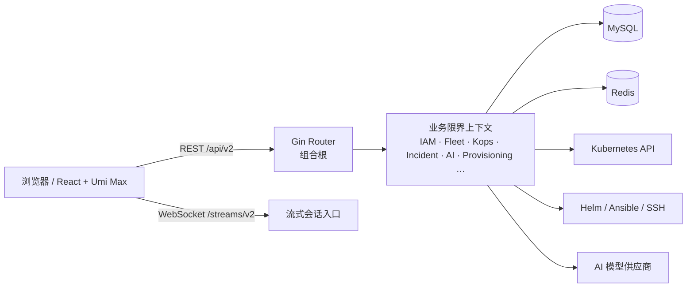

# AIOPS K8S Platform 项目架构说明

> 本文以当前仓库代码结构为准，面向开发、测试和运维人员说明“目录放什么、由谁负责、如何协作”。
> 
> 最后核对：2026-07-30。平台对外 REST API 统一为 `/api/v2`，WebSocket 流使用 `/streams/v2`。

## 1. 架构概览

本项目是一个模块化单体（modular monolith）的 AIOPS / Kubernetes 运维平台：前端按业务功能分组，后端按 DDD 限界上下文分组。各业务上下文独立拥有领域模型、应用服务、端口和基础设施适配器；它们共享同一个后端进程、MySQL 和 Redis，但不应共享业务实现。



后端遵循以下依赖方向。`router` 只组装依赖和注册 HTTP 路由；业务规则不得放入路由、控制器或前端页面。

```text
HTTP Router / composition
          |
          v
adapter (http/mysql/kubernetes/redis/...)
          |
          v
application  <---->  ports
          |
          v
domain
```

## 2. 仓库根目录

```text
k8s-platform/
├─ backend/                 Go 后端服务、领域模块和 Ansible 资产
├─ frontend/                React + TypeScript 前端应用
├─ docs/                    架构、接口、产品与运维文档
├─ .agents/                 本地 Agent 协作元数据，不属于产品运行时
├─ .vscode/                 VS Code 工作区配置
├─ .trae/                   本地编辑器配置
├─ node_modules/            根目录依赖/工具缓存（本地生成，不作为业务源码）
└─ LICENSE                  开源许可证
```

根目录下的 `.tmp-*`、`.umi`、`frontend/dist`、`frontend/node_modules` 与 `backend/.gotmp` 等均为构建、测试或本地工具产生的内容，不应承载业务逻辑，也不应作为架构依赖。

## 3. 后端：`backend/`

### 3.1 顶层目录职责

| 目录 | 职责 | 说明 |
| --- | --- | --- |
| `cmd/api/` | 服务启动入口 | 读取配置、初始化 Zap、MySQL、Redis、JWT、迁移与 Gin HTTP Server，并创建 `router.Deps`。 |
| `internal/` | 平台私有业务代码 | 仅当前 Go module 可引用；所有业务上下文、路由、适配器都在这里。 |
| `pkg/` | 可复用公共库 | 当前主要是响应与 Problem Details 契约，不承载某个具体业务领域。 |
| `ansible/` | 自动化部署资产 | Provisioning 编排使用的 playbook、inventory 模板及相关配置。 |
| `data/` | 本地运行数据 | 开发或本地部署数据；不能作为领域代码归属位置。 |
| `go.mod` / `go.sum` | Go module 与依赖锁定 | Go、Gin、GORM、Redis、Kubernetes client-go、Helm、WebSocket 等依赖。 |

### 3.2 启动与请求链路

`backend/cmd/api/main.go` 是唯一的 HTTP 服务进程入口，依次完成：

1. 通过 `internal/config` 读取文件配置和环境变量覆盖。
2. 通过 `internal/db` 建立 MySQL / GORM 连接，并执行嵌入的 SQL migration。
3. 建立 Redis 缓存、JWT 管理器、IAM 登录服务与初始化 RBAC 数据。
4. 把基础依赖传给 `internal/router.New`。
5. 启动 Gin，并在收到 `SIGINT` / `SIGTERM` 后优雅退出。

HTTP 的执行链如下：

```text
Request
  -> RequestID / AccessLog / Recovery / CORS
  -> /api/v2 或 /streams/v2 路由
  -> JWT + RBAC 鉴权
  -> 审计中间件（写操作）
  -> HTTP adapter/controller
  -> application service
  -> domain / port
  -> MySQL、Redis、Kubernetes、Helm、SSH、AI Provider 等 adapter
```

健康检查不参与 API 版本化：`/livez` 表示进程存活，`/healthz` 表示服务可响应，`/readyz` 额外检查数据库连接。

### 3.3 `internal/` 共享技术目录

| 目录 | 负责内容 | 不应该放入的内容 |
| --- | --- | --- |
| `router/` | HTTP 组合根、模块装配、按领域拆分的路由表 | 领域规则、SQL、Kubernetes 业务操作。 |
| `middleware/` | Request ID、访问日志、恢复、CORS、V2 JWT/RBAC、审计 | 用户、集群、部署等领域服务。 |
| `config/` | 配置加载、配置结构与超时解析 | 业务配置表的读写。 |
| `db/` | 数据库连接、迁移执行器和 `db/migrations/*.sql` | 领域 Repository 查询。 |
| `auth/` | JWT 令牌签发、解析和 Claims | 用户/角色的业务用例；该类能力属于 IAM 的技术支撑。 |
| `transport/cache/` | Redis 缓存抽象与实现 | 某个业务上下文专用的缓存 key 规则。 |
| `transport/secretcrypto/` | 敏感信息加解密 | 凭据、Kubeconfig 的业务生命周期。 |
| `transport/ssh/` | SSH 传输通用能力 | 主机资产、部署计划、终端会话业务。 |
| `architecture/` | 架构守卫测试 | 生产运行时功能。 |
| `orchestration/` | 明确命名的跨上下文工作流 | 单一上下文的 controller、repository 或 service。 |
| `integration/` | 迁移后的保留空边界 | 不再存放 Go 业务实现，防止重新演化为大型遗留仓。 |

### 3.4 业务限界上下文

绝大多数业务目录采用下列垂直切片结构。某些上下文仍在迁移中，目录层级可能暂未齐全；新增业务必须按此方向补齐，不能回到横向 `service` / `controller` 大目录。

```text
internal/<context>/
├─ domain/             实体、值对象、状态机、领域不变量
├─ application/        command/query、事务边界、用例编排
├─ ports/              application 依赖的接口
└─ adapters/
   ├─ http/             DTO、绑定校验、Controller
   ├─ mysql/            Repository、持久化实现
   ├─ kubernetes/       Kubernetes 集成实现（按需要）
   └─ runtime/redis/... 外部运行时实现（按需要）
```

| 上下文目录 | 业务归属 | 典型责任 |
| --- | --- | --- |
| `iam/` | 身份与访问控制 | 登录、验证码、密码重置、用户、角色、权限、RBAC 授权快照。 |
| `workspace/` | 工作空间 | 项目、项目资源、命名空间分配。 |
| `fleet/` | 集群资产与概览 | 集群注册/导入、凭据校验、连接健康、集群概览与证书风险。 |
| `kops/` | Kubernetes 操作面 | 命名空间、节点、Pod、工作负载、网络、配置、存储、RBAC、Helm、资源指标和流式会话。 |
| `incident/` | 监控与事件 | 告警规则、Alertmanager 接入、事件列表、事件生命周期命令。 |
| `ai/` | AI 运维能力 | Provider、模型、工具、对话、附件、AI 消息与变更提案入口。 |
| `change/` | 变更治理 | 变更提案、审批策略、执行授权；前端界面目前仍由 AI 功能承载。 |
| `provisioning/` | 集群交付与主机资源 | 服务器、凭据、部署计划、预检、执行、配置、仓库、Ansible 资产、应用模板。 |
| `audit/` | 审计证据 | 操作人、资源、请求 ID、状态码与操作详情的不可变记录。 |
| `platform/` | 平台级设置 | 系统设置和技术管理入口。 |

业务归属有两个容易混淆的规则：

- “应用模板”归 `provisioning`，因为它是交付输入，不是平台通用设置。
- `auth` 是 JWT 技术组件；用户、角色、密码和权限等业务规则仍归 `iam`。

### 3.5 适配器和端口

`application` 只能依赖本上下文的 `domain` 与 `ports`。例如：

```text
Fleet application
  -> ClusterRepository port
  -> adapters/mysql repository

Kops application
  -> ClusterRuntime port
  -> adapters/kubernetes runtime
```

因此：

- HTTP controller 只做参数绑定、身份获取、调用应用层和映射 V2 响应。
- MySQL / Redis / Kubernetes / Helm / AI Provider 都是 adapter，不应被 domain 直接导入。
- 一个 adapter 不应直接导入另一个业务上下文的 adapter；跨上下文需求应通过公开 port、领域事件或下文的 orchestration 实现。

### 3.6 跨上下文编排：`internal/orchestration/`

`orchestration` 不是通用 service 仓，也不是新的遗留层。这里仅保留必须协调多个上下文的、按工作流命名的实现。

| 目录 | 当前工作流内容 | 协调的主要上下文 |
| --- | --- | --- |
| `orchestration/ai/` | AI Chat 运行时、工具注册、资源查询、动作提案执行与会话投影 | AI、Kops、Change、Audit。 |
| `orchestration/kops/` | Helm 运行时、Metrics Provider 管理、权限审计引擎 | Kops、Fleet、Audit。 |
| `orchestration/provisioning/` | Ansible Runner、预检、部署执行与插件安装 | Provisioning、Fleet、Platform。 |

判断代码是否应放入 `orchestration`：如果它只服务一个上下文，应放回该上下文的 `application` 或 `adapters`；只有一个用例必须同时编排两个以上上下文时，才进入对应的 workflow 目录。

已完成的收敛边界如下：

- 主机 SSH 探测、终端 HTTP/WebSocket 控制器及一次性终端 ticket 已归入 `provisioning/adapters`，通过 `provisioning/ports` 注入 SSH runtime 和 ticket store；它不再共享 Kops 的 Pod Exec 会话。
- 集群部署执行器通过 `provisioning/ports.Repository` 读写部署计划，通过 `DeploymentTaskStore` 与 `ClusterRegistrar` 协作 Platform 任务中心和 Fleet 集群纳管，不再持有 GORM、TaskStore 或 Fleet Registry 实现。
- Metrics Provider 管理器通过 `kops/ports` 读取/更新监控源和获取 Kubernetes client；Fleet 聚合到监控配置的映射位于 `router` 组合根。

### 3.7 `router/` 的组织方式

`internal/router/` 目前是模块化单体的组合根，已按照两个维度拆分：

| 文件类型 | 例子 | 作用 |
| --- | --- | --- |
| `composition_*.go` | `composition_iam.go`、`composition_kops.go` | 创建某个上下文的 application service、adapter、controller 与运行时依赖。 |
| `routes_*.go` | `routes_kops_network.go`、`routes_deploy.go` | 注册该领域的 HTTP path、方法与权限点。 |
| `modules.go` | `applicationModules` | 承载组合后的模块引用，避免把依赖列表塞进一个超长函数。 |
| `router.go` | `New`、`registerRoutes` | 全局中间件、V2 API 组、健康检查与各 route table 的调用顺序。 |

Kops 路由因资源族很多，再细分为 cluster、workloads、network、config/storage、RBAC、batch、Helm 和 updates 文件；这使资源变更不会再集中到一张过大的路由表。

### 3.8 API、错误与流式协议

| 接口类别 | 入口 | 说明 |
| --- | --- | --- |
| REST | `/api/v2` | 所有平台 REST 资源与命令。 |
| 实时流 | `/streams/v2/{ticket_id}` | Pod 日志、Pod Exec 和服务器终端使用 ticket 建立 WebSocket。 |
| 健康检查 | `/livez`、`/healthz`、`/readyz` | 非版本化运行探针。 |
| API 契约 | `docs/openapi/v2.yaml` | V2 OpenAPI 定义与 Problem Details schema。 |
| 错误 | `pkg/problem/` | RFC 9457 风格 `application/problem+json`，含 `type/title/status/detail/instance/request_id`。 |

`pkg/resp/` 保留了统一写响应的技术入口，并按请求的 V2 合同输出资源 JSON 或 Problem Details；业务上下文不应自行发明第二套错误格式。

### 3.9 外部系统边界

| 外部对象 | 对接位置 | 边界说明 |
| --- | --- | --- |
| MySQL | `db` 与各上下文 `adapters/mysql` | 当前为共享实例；表的所有权仍归对应上下文。 |
| Redis | `transport/cache` 与具体 adapter | 缓存、验证码、登录尝试、ticket 等。 |
| Kubernetes | `kops/adapters/kubernetes`、`fleet/adapters/kubernetes` | 仅通过受控 runtime / port 访问；集群凭据错误不能使平台登录失效。 |
| Prometheus / metrics-server | Kops metrics runtime | 它们自身的 API 版本不属于平台 `/api/v2` 契约。 |
| Helm | Kops / orchestration Kops | Release、Repository、安装、升级、回滚。 |
| Ansible / SSH | Provisioning / orchestration Provisioning | 集群交付、预检、远程执行与终端。 |
| LLM Provider | AI adapter / orchestration AI | 对话、工具调用与变更建议。 |

## 4. 前端：`frontend/`

### 4.1 顶层目录职责

| 目录/文件 | 职责 |
| --- | --- |
| `src/` | React 应用的业务代码和共享 UI。 |
| `config/` | Umi Max 配置、页面路由、开发代理。 |
| `public/` | 静态资源，例如品牌图标。 |
| `plugins/` | Umi 插件，例如启动加载页。 |
| `scripts/` | 本地开发、架构守卫等 Node 脚本。 |
| `package.json` | pnpm 脚本、React/Umi/Ant Design/React Query 依赖。 |
| `dist/` | 前端构建输出；可再生，不放业务源码。 |
| `node_modules/` | 本地依赖；可再生。 |

技术栈为 React 18、TypeScript、Umi Max、Ant Design、TanStack React Query、Vitest 和 Playwright。`src/app.tsx` 承担全局布局、请求拦截器、登录失效处理及 QueryClient 初始化；不是业务功能的归属地。

### 4.2 `src/` 目录地图

```text
frontend/src/
├─ features/       按业务上下文组织的页面、接口和类型
├─ components/     跨 feature 的技术型/展示型组件
├─ layouts/        全局布局与 ClusterLayout
├─ hooks/          跨 feature 的通用 React hooks
├─ models/         Umi 全局模型（如用户、主题）
├─ pages/          仅放通用 403 / 404 等非领域页面
├─ shared/         跨 feature 共享的纯类型
├─ styles/         全局样式
├─ theme/          主题变量与主题能力
├─ utils/          无领域归属的工具函数
└─ app.tsx         应用根组合、全局请求与布局行为
```

`src/.umi` 与 `src/.umi-production` 是 Umi 生成物，不能手工修改，也不能让业务代码依赖其内部路径。

### 4.3 `features/` 业务模块

前端 feature 与后端限界上下文基本一一对应：

```text
features/<context>/
├─ api/          V2 HTTP 调用、DTO 映射和请求参数转换
├─ pages/        该上下文拥有的路由页面
├─ types/        前端视图模型和接口类型
├─ schemas/      Zod/表单校验规则（按需）
├─ components/   有领域含义的局部组件（按需）
├─ hooks/        有领域含义的局部 hooks（按需）
└─ index.ts      对其他 feature 暴露的唯一公共入口（存在时）
```

| 前端模块 | 目录内容 | 对应后端归属 |
| --- | --- | --- |
| `features/iam` | 登录页、用户/角色管理、密码修改、校验规则 | IAM。 |
| `features/fleet` | 仪表盘、集群列表/导入/详情、集群 API 和 schema | Fleet。 |
| `features/kops` | 集群资源页、日志、终端、K8s API、资源组件 | Kops。 |
| `features/incident` | 监控仪表盘、告警规则、事件流、事件 API | Incident。 |
| `features/ai` | AI 对话、历史、模型设置、Chat hook、AI API | AI；变更提案界面暂时也在这里。 |
| `features/provisioning` | 部署计划、服务器、凭据、应用商店、部署配置、CI/CD 页面 | Provisioning。 |
| `features/workspace` | 项目和工作空间页面/API | Workspace。 |
| `features/platform` | 系统设置、审计日志 | Platform / Audit 的展示入口。 |

跨模块访问只能导入 `@/features/<context>` 的公开入口，不应深入访问另一个 feature 的 `api`、`types`、`pages` 或 `components`。`frontend/scripts/check-architecture.cjs` 负责守卫这一规则。

### 4.4 页面路由与业务归属

`frontend/config/routes.ts` 描述 URL 到 feature 页面组件的映射。主要页面分区如下：

| URL 区域 | 页面模块 | 用途 |
| --- | --- | --- |
| `/login` | IAM | 平台登录。 |
| `/dashboard`、`/clusters` | Fleet | 全局仪表盘、集群资产和导入。 |
| `/clusters/provision*`、`/clusters/hosts` | Provisioning | 集群交付计划与主机资源池。 |
| `/projects` | Workspace | 项目与命名空间分配。 |
| `/app-store/*` | Provisioning | YAML / Helm 应用模板。 |
| `/monitor/*` | Incident | 监控、告警规则和事件流。 |
| `/config/*` | IAM、Platform、Provisioning | 用户/角色、审计、凭据、部署资产、系统设置。 |
| `/ai/*` | AI | 对话、会话历史与模型配置。 |
| `/cicd/*` | Provisioning | 当前 CI/CD 界面位于 Provisioning feature。 |
| `/cluster/*` | Kops | 已选集群的 K8s 资源浏览和操作。 |

`/deploy/*` 与 `/automation/*` 的旧前端 URL 被保留为 redirect，避免用户收藏链接失效；它们不是新的页面归属。

### 4.5 前端请求与流式会话

| 场景 | 实现位置 | 约定 |
| --- | --- | --- |
| REST 请求 | 每个 `features/*/api` | 使用 `@umijs/max` 的 `request`，目标为 `/api/v2`。 |
| Token 注入/错误处理 | `src/app.tsx` | 自动附加 Bearer Token；只在平台会话失效时清除 token。 |
| Problem Details | `src/app.tsx`、`utils/session-auth.ts` | 识别 RFC 9457 错误；集群凭据失效不会退出 AIOPS 平台。 |
| 终端、Pod 日志、Pod Exec | Kops / Provisioning API 和组件 | 先创建 ticket/session，再连接 `/streams/v2/{ticket_id}`。 |
| 开发代理 | `frontend/config/config.ts`、`proxy.ts` | `/api` 代理 HTTP，`/streams/v2` 代理 WebSocket。 |

## 5. 数据与安全边界

### 5.1 数据所有权

虽然当前各上下文共享 MySQL 实例，表和 Repository 应有明确唯一归属：IAM 只写身份数据，Fleet 只写集群登记，Provisioning 只写交付数据，Audit 只写审计证据。其他上下文通过应用服务、port 或只读投影协作，不能随意跨表写入。

### 5.2 身份、权限与审计

1. IAM 登录后签发 JWT；V2 中间件解析 token 并可刷新 RBAC 权限快照。
2. 路由以 `RequirePermV2` / `RequireAnyPermV2` 保护具体资源与命令。
3. 写操作进入 `AuditLogger`，记录操作者、资源、集群/命名空间、请求 ID、状态与详情。
4. Kubernetes 集群凭据是下游资源访问凭据；其无效状态应返回特定 Problem，而不是当作平台会话过期。

## 6. 开发边界与落位指南

| 需求类型 | 应放目录 | 示例 |
| --- | --- | --- |
| 新增集群状态机规则 | `internal/fleet/domain` | 集群状态转换和不变量。 |
| 新增部署计划用例 | `internal/provisioning/application` | 创建、预检、取消、重试命令。 |
| 新增 MySQL 查询实现 | 对应 `<context>/adapters/mysql` | `DeployPlanRepository` 实现。 |
| 新增 HTTP DTO / handler | 对应 `<context>/adapters/http` | 请求校验、调用 application、映射 Problem。 |
| 新增 Kubernetes API 调用 | `internal/kops/adapters/kubernetes` | 通过 Kops port 提供能力。 |
| 同时操作 AI、Kops、Change | `internal/orchestration/ai` | AI 变更提案确认后的执行工作流。 |
| 新增领域页面 | `frontend/src/features/<context>/pages` | 集群、告警或部署的页面。 |
| 新增领域前端请求 | `frontend/src/features/<context>/api` | `/api/v2` V2 契约调用。 |
| 新增通用视觉组件 | `frontend/src/components` | 状态标签、空状态、通用 YAML 编辑器。 |
| 新增通用技术工具 | `frontend/src/utils` 或 `internal/transport` | 不包含领域命名或规则。 |

以下位置不应再作为新业务代码落点：`internal/integration`、生成目录 `.umi`、构建输出 `dist`、本地缓存目录以及跨业务上下文的“万能 util/service”文件。

## 7. 架构质量门禁

当前项目已具备以下自动守卫：

| 门禁 | 位置 | 防止的问题 |
| --- | --- | --- |
| Go 架构测试 | `backend/internal/architecture` | domain 导入框架、application 反向依赖 adapter、integration 回流、router 再次膨胀、平台 API 回退到 V1。 |
| Router 权限测试 | `backend/internal/router/router_permissions_test.go` | 资源和命令意外放宽 RBAC 权限。 |
| 前端架构检查 | `frontend/scripts/check-architecture.cjs` | feature 之间深层互相导入、技术层反向依赖业务模块。 |
| 前端类型检查 | `pnpm tsc` | API 类型、页面和组件的 TypeScript 回归。 |
| 后端测试与构建 | `go test -p 1 ./...`、`go build ./...` | 编译、路由、领域与适配器回归。 |

## 8. 推荐阅读顺序

1. 先读本文，了解代码的归属和边界。
2. 阅读 `backend/internal/README.md` 和 `frontend/src/features/README.md`，了解后端/前端局部规则。
3. 查看 `docs/openapi/v2.yaml`，确认对外 API 契约。
4. 从 `backend/cmd/api/main.go` -> `internal/router/` 跟踪一次请求的装配过程。
5. 再进入目标上下文的 `domain`、`application`、`ports`、`adapters`；不要从 adapter 直接追到另一个上下文的内部实现。

## 9. 当前架构演进重点

- 模块化单体已经完成按上下文的垂直拆分；部署执行和指标管理已先行通过 port 收敛。下一步应继续拆分权限审计与 Helm 等仍较大的跨上下文工作流，并在可异步、可重试的副作用处引入持久化事件。
- CI/CD 页面目前归 Provisioning feature；若后端形成独立 CI/CD 限界上下文，应同步拆出 `internal/cicd` 与 `features/cicd`，避免目录归属和业务所有权长期不一致。
- 新接口只可新增 V2 契约，并同时更新 `docs/openapi/v2.yaml`、前端 API 模块、路由权限测试与必要的架构守卫。
